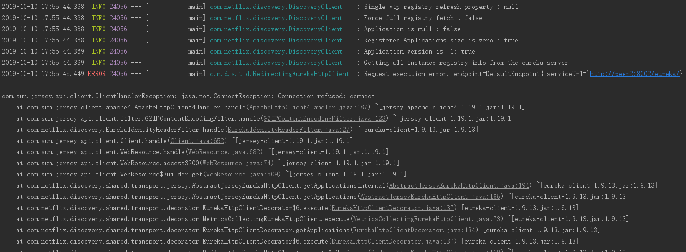
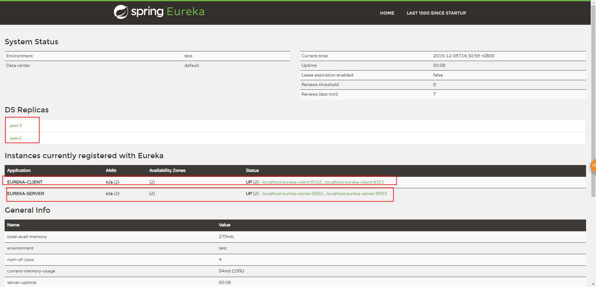

# 案例实践

微服务一般采用 Maven 多 module 结构。所以我们需要创建一个maven主工程；

结构如下：

>   springcloud-chapters
>
>   ​	|__eureka-server
>
>   ​	|__eureka-client-producer

主工程项目springcloud-chapters的 pom 文件如下：

**pom 文件**

```xml
<?xml version="1.0" encoding="UTF-8"?>
<project xmlns="http://maven.apache.org/POM/4.0.0"
         xmlns:xsi="http://www.w3.org/2001/XMLSchema-instance"
         xsi:schemaLocation="http://maven.apache.org/POM/4.0.0 http://maven.apache.org/xsd/maven-4.0.0.xsd">
    <modelVersion>4.0.0</modelVersion>
    <groupId>com.husy</groupId>
    <artifactId>springcloud-chapters</artifactId>
    <version>1.0-SNAPSHOT</version>
    <packaging>pom</packaging>

    <parent>
        <groupId>org.springframework.boot</groupId>
        <artifactId>spring-boot-starter-parent</artifactId>
        <version>2.2.1.RELEASE</version>
        <relativePath/> <!-- lookup parent from repository -->
    </parent>

    <properties>
        <java.version>1.8</java.version>
        <spring-cloud.version>Hoxton.RELEASE</spring-cloud.version>
    </properties>

    <modules>
        <!--注册中心 单实例-->
        <module>eureka-server</module>
        <!--服务提供者  单实例-->
        <module>eureka-client-producer</module>
    </modules>

    <dependencies>
        <dependency>
            <groupId>org.springframework.boot</groupId>
            <artifactId>spring-boot-starter-test</artifactId>
            <scope>test</scope>
            <exclusions>
                <exclusion>
                    <groupId>org.junit.vintage</groupId>
                    <artifactId>junit-vintage-engine</artifactId>
                </exclusion>
            </exclusions>
        </dependency>
    </dependencies>

    <dependencyManagement>
        <dependencies>
            <dependency>
                <groupId>org.springframework.cloud</groupId>
                <artifactId>spring-cloud-dependencies</artifactId>
                <version>${spring-cloud.version}</version>
                <type>pom</type>
                <scope>import</scope>
            </dependency>
        </dependencies>
    </dependencyManagement>
</project>
```


## Eureka Server

**1、pom文件配置**

springcloud 已集成了Eureka 服务器，只需要引用spring-cloud-starter-netflix-eureka-server 依赖即可。在很多博文和文章中都引用的是spring-cloud-starter-eureka-server，这里需要说明一下，spring-cloud-starter-eureka-server是之前的版本，官方推荐使用的是前者。


**pom文件配置**

```xml
<?xml version="1.0" encoding="UTF-8"?>
<project xmlns="http://maven.apache.org/POM/4.0.0" xmlns:xsi="http://www.w3.org/2001/XMLSchema-instance"
         xsi:schemaLocation="http://maven.apache.org/POM/4.0.0 https://maven.apache.org/xsd/maven-4.0.0.xsd">
    <modelVersion>4.0.0</modelVersion>
    <parent>
        <groupId>com.husy</groupId>
        <artifactId>springcloud-chapters</artifactId>
        <version>1.0-SNAPSHOT</version>
    </parent>
    <groupId>com.husy</groupId>
    <artifactId>eureka-server</artifactId>
    <version>0.0.1-SNAPSHOT</version>
    <name>springcloud-demo</name>
    <description>注册中心</description>


    <dependencies>
        <dependency>
            <groupId>org.springframework.cloud</groupId>
            <artifactId>spring-cloud-starter-netflix-eureka-server</artifactId>
        </dependency>
    </dependencies>

    <build>
        <plugins>
            <plugin>
                <groupId>org.springframework.boot</groupId>
                <artifactId>spring-boot-maven-plugin</artifactId>
            </plugin>
        </plugins>
    </build>

</project>
```

**yml 文件配置**

```yml
eureka:
  instance:
    hostname: localhost
  client:
    # 表示是否将自己注册到eureka server，因为要构建集群环境，需要将自己注册到集群中，所以应该开启。默认为true，可不显式设置
    register-with-eureka: false
    # 表示是否从eureka server获取注册信息，如果是单一节点，不需要同步其他eureka server节点，则可以设置为false，但此处为集群，应该设置为true，默认为true，可不设置
    fetch-registry: false
    # 设置与Eureka Server交互的地址，查询服务和注册服务都需要依赖这个地址。
    # 默认是http://localhost:8761/eureka ；多个地址可使用 , 分隔。
    service-url:
      defaultZone: http://${eureka.instance.hostname}:${server.port}/eureka/
server:
  port: 8001
```

**启动类**

```java
@EnableEurekaServer
@SpringBootApplication
public class EurekaServerApplication {
	public static void main(String[] args) {
		SpringApplication.run(EurekaServerApplication.class, args);
	}
}
```

**启动测试**

启动工程后，在浏览器访问：http://localhost:8001，可以看到下面的页面，其中还没有发现任何服务


## Eureka Client

创建module工程 eureka-client-producer，并需要引用spring-cloud-starter-netflix-eureka-client和spring-boot-starter-web 依赖

**pom 文件**

```xml
<?xml version="1.0" encoding="UTF-8"?>
<project xmlns="http://maven.apache.org/POM/4.0.0" xmlns:xsi="http://www.w3.org/2001/XMLSchema-instance"
         xsi:schemaLocation="http://maven.apache.org/POM/4.0.0 https://maven.apache.org/xsd/maven-4.0.0.xsd">
    <modelVersion>4.0.0</modelVersion>
    <parent>
        <groupId>com.husy</groupId>
        <artifactId>springcloud-chapters</artifactId>
        <version>1.0-SNAPSHOT</version>
    </parent>
    <artifactId>eureka-client-producer</artifactId>
    <version>0.0.1-SNAPSHOT</version>
    <name>eureka-client-producer</name>
    <description>服务提供者</description>

    <dependencies>
        <dependency>
            <groupId>org.springframework.boot</groupId>
            <artifactId>spring-boot-starter-web</artifactId>
        </dependency>
        <dependency>
            <groupId>org.springframework.cloud</groupId>
            <artifactId>spring-cloud-starter-netflix-eureka-client</artifactId>
        </dependency>
    </dependencies>

    <build>
        <plugins>
            <plugin>
                <groupId>org.springframework.boot</groupId>
                <artifactId>spring-boot-maven-plugin</artifactId>
            </plugin>
        </plugins>
    </build>
</project>
```

**yml 文件**

```yml
spring:
  application:
    name: eureka-client
server:
  port: 8762
eureka:
  client:
    service-url:
      defaultZone: http://localhost:8001/eureka/
```

**启动类**

```java
@SpringBootApplication
@EnableEurekaClient
public class EurekaClientProducerApplication {
   public static void main(String[] args) {
      SpringApplication.run(EurekaClientProducerApplication.class, args);
   }
}
```

**启动测试**

启动工程 eureka-client-producer，启动成功之后，在控制台会有如下信息打印：

```java
com.netflix.discovery.DiscoveryClient    : DiscoveryClient_EUREKA-CLIENT/localhost:eureka-client:8762 - registration status: 204
```

这说明 Eureka client 客户端已经向Eureka Server 注册了，在浏览器访问 http://localhost:8001，页面显示如下


我们可以看到有一个服务已经注册了。

在工程 eureka-client-producer 中新建一个AIP 接口，Controller 层如下：

```java
@RestController
public class HiController {
   @Value("${server.port}")
   String port;
   @GetMapping("/hi")
   public String home(@RequestParam String name){
      return "hi "+name+",i am form port:"+port;
   }
}
```


## Eureka Cluster Server

在微服务项目中，Eureka Server 的作用举足轻重，如果单服务的话，遇到故障或毁灭性问题。那整个项目将停止运行。因此对Eureka 进行高可用集群是非常必要的；这里只介绍三台集群的配置情况，每台注册中心分别又指向其它两个节点即可；

在这里我们创建module工程 eureka-cluster-server，集群服务端的pom 文件、启动类，都与单体服务一样，无需改变，只需要修改 yml 文件即可，这里我们采用多 profile 的格式，具体如下：

**yml 文件**

```yml
---
spring:
  profiles: peer1
  application:
    name: eureka-server
server:
  port: 8001
eureka:
  instance:
    hostname: peer1
  client:
    serviceUrl:
      defaultZone: http://127.0.0.1:8002/eureka/,http://127.0.0.1:8003/eureka/
---
spring:
  profiles: peer2
  application:
    name: eureka-server
server:
  port: 8002
eureka:
  instance:
    hostname: peer2
  client:
    serviceUrl:
      defaultZone: http://127.0.0.1:8001/eureka/,http://127.0.0.1:8003/eureka/
---
spring:
  profiles: peer3
  application:
    name: eureka-server
server:
  port: 8003
eureka:
  instance:
    hostname: peer3
  client:
    serviceUrl:
      defaultZone: http://127.0.0.1:8001/eureka/,http://127.0.0.1:8002/eureka/
```

搭建完 Eureka Server 集群后，需要修改 host 文件，我的在C:\Windows\System32\drivers\etc 目录下

在文件最后加上以下代码：

>   127.0.0.1 peer1
>
>   127.0.0.1 peer2
>
>   127.0.0.1 peer3

打包编译后，用 java -jar 启动 ，方式如下

>   java -jar eureka-server-1.0-SNAPSHOT.jar --spring.profiles.active=peer1
>
>   java -jar eureka-server-1.0-SNAPSHOT.jar --spring.profiles.active=peer2
>
>   java -jar eureka-server-1.0-SNAPSHOT.jar --spring.profiles.active=peer3

依次启动完成后，浏览器输入：http://localhost:8001/ 效果图如下：


**注意：**

只启动 server1 后，报异常，如下：



这正常现象，只要启动完3个服务后，就不会报错了。小伙伴们不要慌。

## Eureka Cluster Client

在这里我们创建module工程 eureka-cluster-client，集群服务端的pom 文件、启动类，都与单体服务一样，无需改变，只需要修改 yml 文件即可，具体如下：

```yml
---
server:
  profiles: client1
  port: 8101
spring:
  application:
    name: eureka-client
eureka:
  client:
    serviceUrl:
      defaultZone: http://localhost:8001/eureka/
---
server:
  profiles: client2
  port: 8102
spring:
  application:
    name: eureka-client
eureka:
  client:
    serviceUrl:
      defaultZone: http://localhost:8001/eureka/
```

打包编译后，用 java -jar 启动 ，方式如下

>   java -jar eureka-server-1.0-SNAPSHOT.jar --spring.profiles.active=client1 
>
>   java -jar eureka-server-1.0-SNAPSHOT.jar --spring.profiles.active=client2

再次浏览器输入：http://localhost:8001/  ；页面显示如下：

