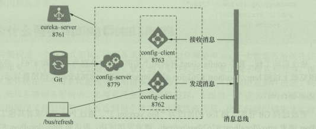

# 案例演练

## eureka-server-config

主Maven 工程下，创建一个Module 工程 eureka-server-config ，引入依赖spring-cloud-config-server

**pom 文件**

```xml
<dependency>
    <groupId>org.springframework.cloud</groupId>
    <artifactId>spring-cloud-config-server</artifactId>
</dependency>
```

**启动类**

```java
@EnableConfigServer
@SpringBootApplication
public class EurekaServerConfigApplication {
   public static void main(String[] args) {
      SpringApplication.run(EurekaServerConfigApplication.class, args);
   }
}
```

**yml 文件**

```yml
spring:
  cloud:
    config:
      server:
        native:
          search-locations: classpath:/share
  profiles:
    active: native
  application:
    name: eureka-server-config
server:
  port: 8004
```

在工程的 Resources 目录下建 shared 文件夹，用 于存放本地配置文 。在 shared 目录下，新建 eureka-client-config-dev. yml 文件，用作 eureka-client-config 工程 dev （开发环境〉的配置文件，并定义一个word 变量，具体如下：

**eureka-client-config-dev. yml**

```yml
server:
  port: 8207
word: hello world 1
```


Spring Cloud Config 有它的一套访问规则，我们通过这套规则在浏览器上直接访问就可以。

>   /{application}/{profile}[/{label}] 
>
>   /{application}-{profile}.yml 
>
>   /{label}/{application}-{profile}.yml 
>
>   /{application}-{profile}.properties 
>
>   /{label}/{application}-{profile}.properties

{application} 就是应用名称，对应到配置文件上来，就是配置文件的名称部分，例如我上面创建的配置文件。

{profile} 就是配置文件的版本，我们的项目有开发版本、测试环境版本、生产环境版本，对应到配置文件上来就是以 application-{profile}.yml 加以区分，例如application-dev.yml、application-sit.yml、application-prod.yml。

{label} 表示 git 分支，默认是 master 分支，如果项目是以分支做区分也是可以的，那就可以通过不同的 label 来控制访问不同的配置文件了。


## **远程Git 仓库读取配置文件**

修改 application.yml 代码如下：

```java
spring:
#  profiles:
#    active: native
  cloud:
    config:
      server:
        native:
          search-locations: classpath:/share
#        git:
#          uri: https://github.com/HusyCoding/springcloud-chapters
#          search-paths: eureka-server-config/shareconfig
#          username:
#          password:
#          default-label: master

  application:
    name: eureka-server-config
server:
  port: 8004
```

读者可 以自己申请 GitHub 账号，并在 GitHub 上创建代码仓库，将eureka-client-dev.yml 上传到自己的仓库

**注意**：其中， uri 为远程 Git 仓库的地址， serachPaths 为搜索远程仓库的文件夹地址， usemame、passwor 为Git 仓库的登录名和密码。如果是私人 Git 库，登录名和密码是必须的；如果是公开 Git ，可以不需要。 label 为 git 库的分支名，本例从 master 读取。


**测试**

启动服务，接下来测试一下。

Spring Cloud Config 有它的一套访问规则，我们通过这套规则在浏览器上直接访问就可以。

我们这里通过浏览器输入http://localhost:8004/eureka-client-config-dev.yml，页面显示如下：

>   server:  
>
>   ​	port: 8207 
>
>   word: hello world 1


## eureka-client-config

主Maven 工程下，创建一个Module 工程 eureka-client-config ，引入依赖spring-cloud-starter-config、spring-boot-starter-web

**pom 文件**

```xml
<dependency>
    <groupId>org.springframework.boot</groupId>
    <artifactId>spring-boot-starter-web</artifactId>
</dependency>
<dependency>
    <groupId>org.springframework.cloud</groupId>
    <artifactId>spring-cloud-starter-config</artifactId>
</dependency>
```

**配置文件**

注意，这里的配置文件用bootstrap.yml，而不是application.yml，bootstrap相对于application具体优先的执行顺序，

**bootstrap.yml如下：**

```yml
spring:
  application:
    name: eureka-client-config
  cloud:
    config:
      uri: http://localhost:8004
      fail-fast: true
  profiles:
    active: dev
```

**启动类**

这里我们配置一个API 接口，读取eureka-server-config 中的变量 word ，具体如下：

```java
@RestController
@SpringBootApplication
public class EurekaClientConfigApplication {
   public static void main(String[] args) {
      SpringApplication.run(EurekaClientConfigApplication.class, args);
   }
   @Value("${word}")
   String word;
   @RequestMapping("/hi")
   public  String hi(){
      return word;
   }
}
```


**启动测试**

启动 工程eureka-server-config 后，在启动eureka-client-config。在浏览器 访问[http://localhost:8207/hi](http://localhost:8005/hi)，页面显示如下：

>   hello world 1

显然我们服务端拿到了变量


## 高可用Config Server

这里指 Config Server 、Config Client 向 Eureka Server 注册，且将 Config Server 多实例集群部署。

采用方式是Config Server 引入 起步依赖 spring-cloud-starter-netflix-eureka-server

Config Client 引入 起步依赖 spring-cloud-starter-netflix-eureka-client


**改造eureka-server-config 工程**

**pom文件如下：**

```xml
<dependency>
    <groupId>org.springframework.cloud</groupId>
    <artifactId>spring-cloud-config-server</artifactId>
</dependency>
<dependency>
    <groupId>org.springframework.cloud</groupId>
    <artifactId>spring-cloud-starter-netflix-eureka-server</artifactId>
</dependency>
```

**配置文件**

```yml
spring:
  cloud:
    config:
      server:
        native:
          search-locations: classpath:/share
  profiles:
    active: native
  application:
    name: eureka-server-config
server:
  port: 8004
eureka:
  client:
    service-url:
      defaultZone: http://localhost:8001/eureka
```

**启动类**

```java
@EnableEurekaServer
@EnableConfigServer
@SpringBootApplication
public class EurekaServerConfigApplication {
   public static void main(String[] args) {
      SpringApplication.run(EurekaServerConfigApplication.class, args);
   }
}
```


**改造eureka-client-config 工程**

**pom文件如下：**

```xml
<dependency>
    <groupId>org.springframework.boot</groupId>
    <artifactId>spring-boot-starter-web</artifactId>
</dependency>
<dependency>
    <groupId>org.springframework.cloud</groupId>
    <artifactId>spring-cloud-starter-config</artifactId>
</dependency>
<dependency>
    <groupId>org.springframework.cloud</groupId>
    <artifactId>spring-cloud-starter-netflix-eureka-client</artifactId>
</dependency>
```


**启动类**

启动类增加 `@EnableEurekaClient` 注解

**配置文件**

```yml
spring:
  application:
    name: eureka-client-config
  cloud:
    config:
      fail-fast: true
      discovery:
        enabled: true
        service-id: eureka-server
  profiles:
    active: dev
eureka:
  client:
    service-url:
      defaultZone: http://localhost:8001/eureka
```

依次启动 eureka-server、 eureka-server-config、 eureka-client-config 工程，在浏览器 访问[http://localhost:8207/hi](http://localhost:8005/hi)，页面显示如下：

>   hello world 1

显然我们服务端从 Git 仓库读取到了配置文件

如果我们将 eureka-server-config 多启动几个实例，然后多次启动 eureka-client-config  我们从控制台会发现它会轮流去这几个实例读取配置文件


## Spring Cloud Bus 刷新配置

当我们在更新github上面的配置以后，如果想要获取到最新的配置，需要手动刷新或者利用webhook的机制每次提交代码发送请求来刷新客户端，如果有几十个微服务，而每一个服务又是多实例，当更改配置时，需要重新启动多个微服务实例，会非常麻烦。 Spring Cloud Bus（消息总线）的一个功能就是让这个过程变得简单，当远程 Git 库的配置更改后，只需要向某一个微服务实例发送 Post 请求，通过消息组件通知其他微服务实例重新拉取配置文件。

Spring Cloud Bus 是用轻量的消息代理将分布式的节点连接起来，可以用 于广播配置文件的更改或者服务的监控管理。 Spring bus的一个**核心思想**是通过分布式的启动器对spring boot应用进行扩展，也可以用来建立一个多个应用之间的通信频道。目前唯一实现的方式是用AMQP消息代理作为通道，同样特性的设置（有些取决于通道的设置）在更多通道的文档中

Spring Cloud Bus 可选的消息代理组建包括 RabbitMQ、 AMQP 、Kafka 等



这里了从Git 上读取，因此eureka-server-config项目改造如下：

**pom文件**

```yml
spring:
#  profiles:
#    active: native
  cloud:
    config:
      server:
#        native:
#          search-locations: classpath:/share
        git:
          uri: https://github.com/HusyCoding/springcloud-chapters
          search-paths: eureka-server-config/shareconfig
          username:
          password:
          default-label: master
  application:
    name: eureka-server-config
server:
  port: 8004
eureka:
  client:
    service-url:
      defaultZone: http://localhost:8001/eureka
```

在GitHub仓库https://github.com/HusyCoding/springcloud-chapters中的eureka-server-config/shareconfig 位置，我们的eureka-client-config-dev.yml 如下：

```yml
server:
  port: 8207
word: hello world 1
```


**eureka-client-config**

eureka-client-config是我们主要改造项目，这里引入用 RabbitMQ 实现的 Spring Cloud Bus 的起步依赖 spring-cloud-starter-bus-amqp，和 spring-boot-starter-actuator

```xml
<!-- springcloud-bus依赖实现配置自动更新，rabbitmq -->
<dependency>
    <groupId>org.springframework.cloud</groupId>
    <artifactId>spring-cloud-starter-bus-amqp</artifactId>
</dependency>
<dependency>
    <groupId>org.springframework.boot</groupId>
    <artifactId>spring-boot-starter-actuator</artifactId>
</dependency>
```

**bootstrap.yml 增加**

```yml
management:
  endpoint:
    bus-refresh:
      enabled: true
  endpoints:
    web:
      exposure:
        include: bus-refresh
```

**启动类**

增加 @RefreshScope

```java
@RefreshScope
@EnableEurekaClient
@RestController
@SpringBootApplication
public class EurekaClientConfigApplication 
```

**测试**

1、依次启动 eureka-server、 eureka-server-config、 eureka-client-config 工程，在浏览器 访问[http://localhost:8207/hi](http://localhost:8005/hi)，页面显示如下：

>   hello world 1

2、修改GitHub仓库的eureka-client-config-dev.yml 文件中word变量为 hello world 2，**使用POST  请求** **http://localhost:8207/actuator/bus-refresh** **，**

>   //cmd 命令方式，也可以使用postman
>
>   curl -v -X POST "http://localhost:8207/actuator/bus-refresh"

在次浏览器访问[http://localhost:8207/hi](http://localhost:8005/hi)，页面显示如下：

>   hello world 2


**问题说明**

如果参照网络上很多博客配置时，我们会出现很多问题，如：

**异常 ：**请求**/actuator/bus-refresh** 刷新 404

1、首先需要确认Spring Cloud Bus配置是否如下

```yml
management:
  endpoint:
    bus-refresh:
      enabled: true
  endpoints:
    web:
      exposure:
        include: bus-refresh
```

Spring boot 2.0的改动较大，/bus/refresh 全部整合到 actuador 里面了，变成了/actuator/bus-refresh，所以之前1.x的management.security.enabled全部失效，不适用于2.0 ，并且网络上修改为 management.endpoints.web.exposure.include=* ，不够全面。还需要 management.endpoint.bus-refresh.enabled=true

2、 再次确认 是否引入 spring-boot-starter-actuator 依赖，因为 Spring boot 2.0的改动，/bus-refresh需要 actuador的支持