优化SQL语句通常我们从几个方面考虑，索引、表分析、排序等

# SQL 的执行顺序

要想优化MySQL的查询语句，必须先了解查询 SQL 的执行顺序

一个完整的Query SQL，如下：

```sql
select distinct 
    <select_list>
from
    <left_table><join_type>  
join  <right_table> on <join_condition>
where
    <where_condition>
group by
    <group_by_list>
having
    <having_condition>
order by
    <order_by_condition>
limit <limit number>
```

SQL执行顺序如下：

1. from <left_table><join_type>
2. on <join_condition>
3. <join_type> join <right_table>
4. where <where_condition>
5. group by <group_by_list>
6. having <having_condition>
7. select
8. distinct <select_list>
9. order by <order_by_condition>
10. limit <limit_number>


# 常见优化方案

## 大批量数据插入

当用load 命令导入数据时，我们可以适当的提高导入速度，举例说明，

1、对MyISAM存储引擎，可通过如下方式加快导入

```sql
alter table <table_name> disable keys;
loading data infile 'aaa.txt';
alter table <table_name> enable keys;
```

disable keys 和 enable keys 用来打开或关闭 MyISAM 表非唯一索引的更新，从而提高效率。默认情况下是关闭状态，所以不用进行设置

2、对于 InnoDB 存储引擎，其表主要是按主键顺序保存了，如果我们导入的数据按照主键顺序排列，可以适当提高导入效率

3、对于 InnoDB 存储引擎，我们可以在导入数据前执行 set unique_checks = 0 来关闭唯一性校验，从而提高效率

4、对于 InnoDB 存储引擎，如果使用程序进行提交，可以执行 set autocommit = 0 来关闭自动提交。从而提高效率


## insert 语句优化

当进行数据插入时，如果同时对同张表插入多行数据，应使用多个值的INSERT 语句，如

```sql
insert into table_name values(),(),()...
```


## 嵌套查询优化

有时我们通常会将一个查询结果作为一个过滤条件进行查询，如下

```sql
select * from teacherwhere teacher_id in (select teacher_id from clazz where class_name = '语文')
```

这样的查询在有些情况下，使用连接查询（JOIN）代替会更有效率，尤其是在对关联字段上建有索引，效果更明显


## OR 查询优化

对于含有 or 的查询子句，如果要利用索引，则必须在or 两边的条件列都有索引


## 分页查询优化

分页查询是一个比较头痛的问题。要想优化它，我们可以采取以下思路：

先在索引上完成分页排序操作，最后根据主键查询所需要的其他内容，如下：

```sql
select name,age,sex from user order by age limit 100000,10
```

改造如下：

```sql
select name,age,sex from user u
inner join (select user_id from user order by age limit 100000,10) t 
on t.user_id = u.user_id
```


## 统计查询优化

对于数据量较大的表，我们在其上进行统计时通常效率都会很低。还会对在线的应用产生负面影响。在这种情况下，我们可以采用中间表。中间表在统计查询时会经常用到，其优点如下：

1. 中间表负责源表部分数据后，在源表上做统计不会对线上应用产生影响
2. 中间表上可以灵活地增加索引或增加临时用的新字段，以此来提高统计效率和辅助统计的作用


# 语法优化

在遵循 MySQL 数据库表结构设计规约和MySQL 索引设计规约的情况下，对慢查询进行优化

**脚本规范优化**

```sql
禁止使用 select * 方式，必须使用SELECT <字段列表> 查询
禁止使用不含字段列表的INSERT语句，如：insert into values ('a','b','c');
禁止使用order by rand() 进行随机排序
只需要查询一行数据时使用 LIMIT 1
充分利用表上已经存在的索引，并遵循最左前缀原则
避免使用 join 关联太多的表
对应同一列进行or判断时，使用in代替 or
在明显不会有重复值时使用 union all 而不是 union
拆分复杂的大SQL为多个小SQL
```

**避免使用JOIN关联太多的表**

在Mysql中，对于同一个SQL多关联（join）一个表，就会多分配一个关联缓存，如果在一个SQL中关联的表越多，所占用的内存也就越大。容易造成服务器内存溢出的情况；Mysql最多允许关联61个表，建议不超过5个。

**对应同一列进行or判断时，使用in代替or**

in的值不要超过500个in操作可以更有效的利用索引，or大多数情况下很少能利用到索引。建议控制 in 的个数在200内

建议改为 inner join 查询，或者使用 union 使用连接（join）来代替子查询，或者尽量少用JOIN 查询，尽量单表查询，因为执行子查询时，MYSQL需要创建临时表，查询完毕后再删除这些临时表。


# 索引失效情况

* 最左前缀原则导致失效
* 模糊查询导致失效
* 隐式转换导致失效
* OR 或 IN 导致失效
* 函数运算导致失效
* 全表查比索引查效率高
* 连接查询中，按照优化器顺序的第一张表不会走索引
* NULL 值判断导致失效、不等号、大于小于号导致失效，5.8版本中已不会失效


下面我们便使用 explain 分析一下，当前环境，MySQL 版本 8.0，引擎 InnoDB， 这里创建 2 个表 user 和 job ，具体数据表结构如下：

```sql
DROP TABLE IF EXISTS `user`;
CREATE TABLE `user` (
	`id` INT(11) NOT NULL AUTO_INCREMENT,
	`name` VARCHAR(20) NULL DEFAULT NULL,
	`sex` VARCHAR(50) NULL DEFAULT NULL,
	`age` INT(4) NULL DEFAULT NULL,
	`address` VARCHAR(50) NULL DEFAULT NULL,
	PRIMARY KEY (`id`) USING BTREE,
	INDEX `idx_sex` (`sex`) USING BTREE,
	INDEX `idx_age` (`age`) USING BTREE,
	INDEX `idx_name_age_address` (`name`, `age`, `address`) USING BTREE
)
COLLATE='utf8mb4_0900_ai_ci'
ENGINE=InnoDB;
```

## 最左前缀原则导致失效

这里测试 `user` 表的 `idx_name_age_sex` 索引

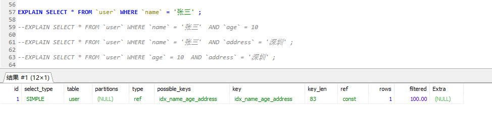

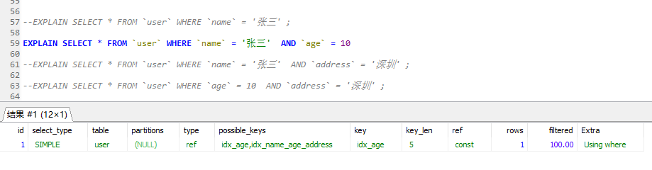

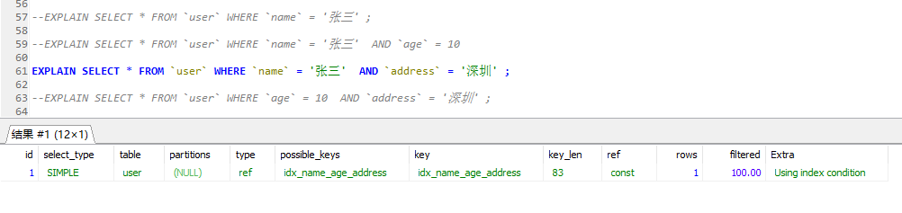


有上图可以看出，**最左前缀原则是指在联合索引中，第一个索引列，必须存在**，否则无法使用该联合索引

为什么是这种规则呢？

因为 B+ 树的结构是复合型数据结构，必须按照从左到右的顺序建立树，如果没有第一列，就不知道该怎么找到节点。


## 模糊查询导致失效


由上图可知在 where 子查询条件中，模糊查询 like 在使用 '%' 时，出现的位置不同，索引效果不同，很明显：模糊查询中，使用后缀查询会是索引失效，但可以使用前缀查询。

不过，在实际开发中前缀模糊查询的方式往往不能满足需求


## 隐式转换导致失效

隐式转换是指查询条件中的索引列的类型和查询条件值得类型不一致，而发生了隐式转换。

一般指，数字转换为字符串的情况


有上图可以看出，在  `name = 111` 的条件中，虽然找到了  `idx_name_age_sex` 索引，但key 列为空，索引并没有被使用


## OR 或 IN 导致失效

**对应 IN 或 NOT IN 的情况：**

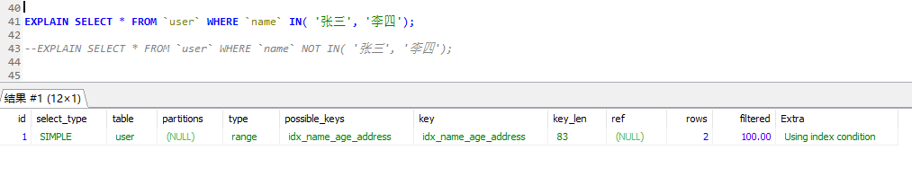


通过上图我们可以非常诧异！！ 为什么？网络上不是说 IN 或 NOT IN 会导致索引失效吗？

不要惊慌，以上测试，我们的 `idx_name_age_address` 采用的BTREE 算法，

如果我们换成 HASH 算法呢？

结果还是一样…

所以，总结一下：在 MySQL 8.0 ，引擎为 InnoDB 的条件下，IN 或者 NOT IN 在使用索引才行时，无论采用 BTREE 还是 HASH 算法，索引都不会失效

那其他版本了，我从 5.6.43-log 、5.7.27 版本中又测试了一下，发现在MySQL 5.6 版本中，IN 和 NOT IN 是无法使用索引的

**个人认为，在在MySQL 5.6 版本和其以下版本中，IN 和 NOT IN 才会无法使用索引的**


**对应 OR 的情况：**

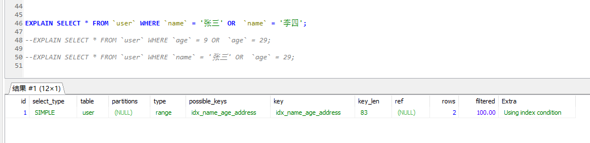

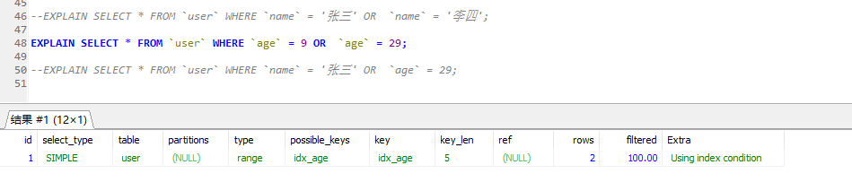


由上图可以看出， **or 是使索引失效，指的是 or 两边不同列的情况。**

对于这种失效情况，我们可以使用覆盖索引进行优化，如下：

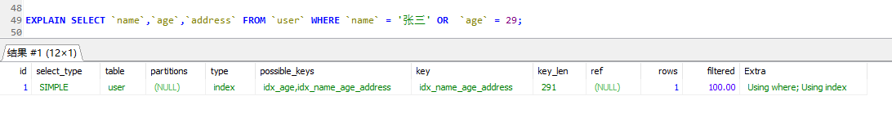

所查出的列全都属于 `idx_name_age_address` 索引的列。

**建议：使用 IN 代替 OR 查询**

/Youdao/qq91988F5E04762DF8EA04C1E72B17F295/a55263fdc7054878962cd2bcdd8f166e/clipboard.png)

## 函数运算导致失效

在where子句中，索引列参与到函数计算时索引会失效


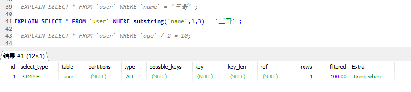

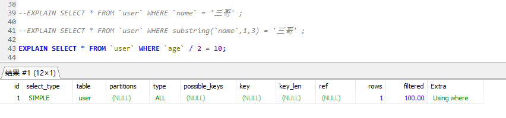

由上图可见，当我们将索引列 进行函数运算时，索引将会失效；

在实际开发中，我们最常见的就是对日期、时间字段进行转换了，千万不要在这类字段上使用函数，否则会索引失效，如下：

反例：

```sql
where date(create_time)='2019-01-01'
```

推荐：

```sql
where create_time > date_format('2019-01-01 12:12:12','%Y-%m-%d')
```

或者

```sql
where create_time <= '2019-01-01 00:00:00'  and create_time > '2019-01-01 23:59:59' 
```


## NULL 值判断导致失效


通过上图我们可以发现 IS NULL 或 IS NOT NULL 不会导致索引失效

这里我们可以思考一下，这是不是也如同 IN 的效果一样呢？是与版本有关

在 5.6.46-log 版本中， IS NULL 是会走索引的，但是  IS NOT NULL 出现了特别的结果

当 name 字段为 NULL 数据条数在2条内，索引依然有效，超过2条索引会失效， NOT NULL 也存在相同的规则，

如下，数据条数在2条内：

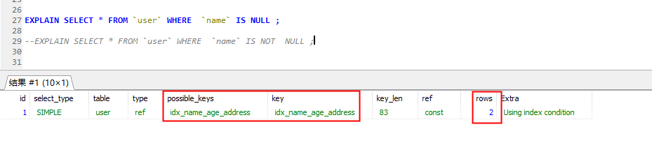


如下，数据条数超过2条内：

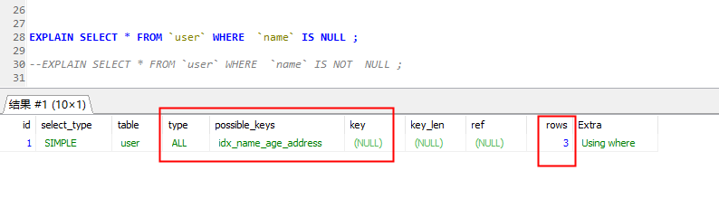


MySQL 5.7 同样存在此问题。但 5.8 不会出现这情况。不过这是为什么呢？下面有篇文章解释的非常不错

https://mp.weixin.qq.com/s/CEJFsDBizdl0SvugGX7UmQ

**总结：在MySQL 5.8 版本中，IS NULL 和 IS NOT NULL 不会使索引失效，但 MySQL 5.6,5.7 索引不一定会失效，因为可能全表查比索引查效率更高**


## 不等号、大于小于号导致失效

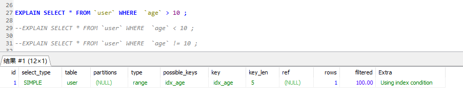

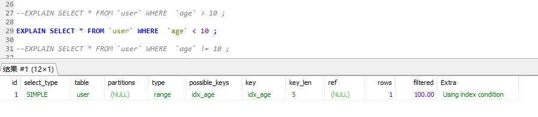

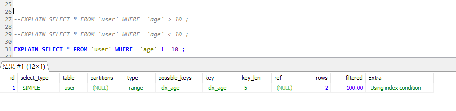

在MySQL 5.8 版本 ，不等号、大于小于号不会导致索引失效，但是在5.6，5.7 版本中 “!=”  ，也会因为数据量不同，效果不同。


**总结：**

**在MySQL 5.8 版本中，不等号 、大于小于号不会使索引失效，**

**但 MySQL 5.6,5.7 中 大于小于号不会使索引失效 ，但不等号索引不一定会失效，因为可能全表查比索引查效率更高**


# 表结构优化

我们在选择数据类型时需要根据应用的需要进行判断，在设计时我们考虑字段的长度留一定的冗余，但不推荐大量冗余，这样既浪费磁盘存储空间，还在程序操作时浪费内存;

## procedure analyse()分析

在MySQL中我们可以使用函数 procedure analyse() 对表进行分析，该函数可以对表中列的数据类型提出优化建议，我们可以酌情考虑，如下

```sql
SELECT * FROM enterprise procedure analyse();
```


## 拆分表

通常拆分表结构，我们有两种方式：垂直拆分和水平拆分

* 垂直拆分：将表的列分别存储到多个表中
* 水平拆分：将表的数据行分别存储到多个表中

优点：

1. 当表很大时，分割后可以降低在查询时需要读取数据和索引的页数，同时也降低了索引层数，从而提高效率
2. 表中的数据可能记录不同时期，或不同地区的数据，有时我们并不需要全部数据，所以垂直查拆分能减少I/O次数
3. 可以将数据存储多个介子中，如：备份数据放在备份库即可；

缺点：

1. 水平拆分增加查询的复杂度，通常需要查询多个表，并使用union操作


## 反规范操作

通常根据实际情况，我们需要一些反规范的操作来提高查询性能，常用的反规范操作有：冗余列、派生列、重组表。

* 冗余列：指在多个表中增加相同的列，以此来避免连接查询
* 派生列：指该列的数据来自其他表，由其他表经过计算生成，作用是为了减少连接查询，避免使用函数
* 重组表：指将用户需要从多个表查出的数据，放在一个表中，以此来避免连接查询，从而提高性能

当然此中方式，通常我们数据更新不及时，这时我们需要采取以下措施进行一定的数据维护，以此来保证数据的完整性，常用方式有：批处理、应用逻辑、触发器。其中触发器是解决这类问题的最好方法。


# 内存优化

内存是影响数据库性能的重要资源，所以也是性能优化的一个重要方面，这里主要介绍MyISAM和InnoDB的内存优化方案

## MyISAM内存优化

MyISAM 存储引擎使用key buffer 缓存索引块，以加速MyISAM 所以的读写速度，对MyISAM表数据库，MySQL没有特别的缓存机制，完全依赖于操作系统的IO缓存

我们可以使用 **key_buffer_size** 来设置缓存区大小。对于一般MyISAM数据库，建议至少将1/4 的内存分隔缓存区

## InnoDB 内存优化

InnoDB 存储引擎是用一块内存做IO缓存池，该缓存池不仅用来缓存InnoDB的索引块，还会缓存数据块，这一点和MyISAM 有区别。

在InnoDB中我们可以设置**innodb_buffer_pool_size** 决定它的表数据和索引数据的最大缓存区大小。innodb_buffer_pool_size  的值越大，缓存命中率越高，访问InnoDB表需要的磁盘I/O越少，因此性能也越高。

一个专用的数据库服务器上，我们可以将80%的内存分配给缓存池