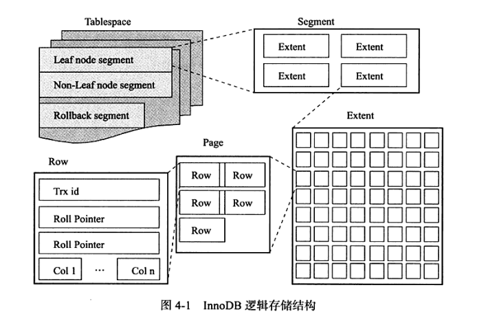

MySQL存储引擎主要有： MyIsam，InnoDB，BDB，Memory，Archive，Federated等；其中InnoDB，BDB提供事务安全表，其他都是非事务安全表。

如果新建表时不指定存储引擎，系统会使用默认引擎，5.5版本之前默认MyISAM，5.5之后改为InnoDB。

查看当前默认存储引擎，命令如下：

```sql
show variables like 'table_type';
```


# MyISAM 和 InnoBD区别

* **数据库文件差异**：每个MyISAM在磁盘上存储成三个文件，而InnoDB只有两个文件，每个文件名以表名开头，扩展名指出文件类型。 MyISAM的 frm文件存储表定义；MYD 用于存放数据；MYI 用于存放表索引。Innodb的 frm是表定义文件，ibd是数据文件，InnoDB 表的大小只受限于操作系统文件的大小
* **事务差异**：MyISAM不提供事务支持； InnoDB提供事务支持事务，外部键等功能
* **索引差异**：1、索引结构上：InnoDB是聚集索引，使用B+Tree作为索引结构，数据文件是和（主键）索引绑在一起的，且必须要有主键，通过主键索引效率很高； MyISAM是非聚集索引，也是使用B+Tree作为索引结构，索引和数据文件是分离的，索引保存的是数据文件的指针。主键索引和辅助索引是独立的。也就是说：InnoDB的B+树主键索引的叶子节点就是数据文件，辅助索引的叶子节点是主键的值；而MyISAM的B+树主键索引和辅助索引的叶子节点都是数据文件的地址指针；2、myisam支持 FULLTEXT类型的全文索引，innodb不支持FULLTEXT类型的全文索引，PS：5.7以后的InnoDB支持全文索引了；3、索引保存位置myisam的索引以表名+.MYI文件分别保存。innodb的索引和数据一起保存在表空间里。
* **锁差异**：MyISAM只支持表锁，InnoDB提供表锁、行锁(默认）
* **主键差异**：1、myisam允许没有任何索引和主键的表存在，myisam的索引都是保存行的地址。innodb引擎如果没有设定主键或者非空唯一索引，就会自动生成一个6字节的主键(用户不可见)
* **自增长列差异**：myisam引擎的自动增长列必须是索引，如果是组合索引，自动增长可以不是第一列，他可以根据前面几列进行排序后递增。innodb引擎的自动增长列必须是索引，如果是组合索引也必须是组合索引的第一列。
*  **在增删改和查询的操作上**：1、如果执行大量的SELECT，MyISAM是更好的选择（MyISAM 适合读多，并发少的场景）；执行大量的update和insert最好用innodb。；2、在delete from table使用这条命令时，innodb不会从新建立表，而是一条一条的删除数据(推荐使用truncate table）
* **表行数取值差异**：myisam保存有表的总行数，如果select count(*) from table;会直接取出出该值。innodb没有保存表的总行数，如果使用select count(*) from table；就会遍历整个表，消耗相当大，但是在加了wehre条件后，myisam和innodb处理的方式都一样。


**如何选择：**

1. 是否要支持事务，如果要请选择innodb，如果不需要可以考虑MyISAM；

2. 如果表中绝大多数都只是读查询，可以考虑MyISAM，如果既有读也有写，请使用InnoDB。

3. 系统奔溃后，MyISAM恢复起来更困难，能否接受；

  4. MySQL5.5版本开始Innodb已经成为Mysql的默认引擎(之前是MyISAM)，说明其优势是有目共睹的，如果你不知道用什么，那就用InnoDB，至少不会差。


# MyIASM

MyIASM是 MySQL 5.5.8版本之前的默认的引擎，但是**它不提供事务支持，也不支持行级锁和外键，但支持全文索引**，因此当 INSERT(插入)或 UPDATE(更新)数据时即写操作需要**锁定整个表**，效率便会低一些。读取操作的速度很快，而且不占用大量的内存和存储资源

每个MyIASM 在磁盘上 存储3个文件，其文件名和表名相同，但扩展名分别是：

* .frm（存储表定义）
* .MYD（MYData，存储数据）
* .MYI（MYIndex，存储索引）


# InnoDB

InnoDB 存储引擎**支持事务，主要特点是行锁设计和支持外键**，从MySQL 5.5.8版本开始已经是默认的存储引擎。由于提供了具有提交、回滚和奔溃恢复能力的事务安全。比MyISAM引擎写操作效率差些。

对于数据存储，InnoDB采用 聚集的方式，每张表都是按主键的顺序存放的，如果没有定义指定主键，InnoDB会为每一行生成一个6字节的rowID作为主键。

从InnoDB存储引擎的逻辑存储结构看，所有数据都被逻辑地存放在一个空间中，称 之为表空间（tablespace）。表空间又由段（segment）、区（extent）、页（page）组成。页在 一些文档中有时也称为块（block）。表空间可以看做是InnoDB存储引擎逻辑结构的最髙层，所有的数据都存放在表空 间中。表空间是由各个段组成的，常见的段有数据段、索引段、回滚段等。同大多数数据库一样，InnoDB有页(Page)的概念(也可以称为块)，页是InnoDB 磁盘管理的最小单位（默认每个页的大小为16KB）。



InnoDB存储引擎的关键特性包括：

1. 插入缓冲(InsertBuffer)

2. 两次写(DoubleWrite)

3. 自适应哈希索引(AdaptiveHash Index)

4. 异步IO(Async IO)

5. 刷新邻接页(FlushNeighbor Page)

    

## 插入缓冲(InsertBuffer)

在InnoDB存储引擎中，主键是行唯一的标识符。通常应用程序中行记录的插入顺序是按照主键递增的顺序进行。因此，插入聚集索引(primay key)一般是顺序的，不需要磁盘的随机读取。因此，对于这类情况下的插入操作，速度是非常快的。

但并不是所有的主键插入都是顺序的。若主键类是UUID这样的类，那么插入和辅助索引一样，同样是随机的。即使主键是自增类型，但是插入的是指定的值，而不是NULL值，那么同样可能导致插入并非连续的情况。同时我们不可能每张表上只有一个聚集索引，更多情况下，一张表上有多个非聚集的辅助索引 (secondary index)，

在这样的情况下产生了了一个非聚集的且不是唯一的索引。在进行插入操作时，数据页的存放还是按主键a进行顺序存放的，但是对于非聚集索引叶子节点的插入不再是有序的了，这时就需要离散地访问非聚集索引页，由于随机读取的存在而导致了插入操作性能下降。

InnoDB存储引擎开创性地设计了Insert Buffer, 对于非聚集索引的插入或更新操作，不是每一次直接插入到索引页中，而是先判断插入的非聚集索引页是否在缓冲池中，若在，则直接插入；若不在，则先放入到一个Insert Buffer对象中，好似欺骗。数据库这个非聚集的索引已经插到叶子节点，而实际并没有，只是存放在另一个位置。然后再以一定的频率和情况进行Insert Buffer和辅助索引页子节点的merge (合并）操作，这时通常能将多个插入合并到一个操作中（因为在一个索引页中），这就大大提高了对于非聚集索引插入的性能。

然而Insert Buffer 的使用需要同时满足以下两个条件：

1. 索引是辅助索引(secondary index);
2. 索引不是唯一(unique) 的。

当满足以上两个条件时，InnoDB 存储引擎会使用Insert Buffer, 这样就能提高插入操作的性能了。

不过考虑这样一种情况：应用程序进行大量的插入操作，这些都涉及了不唯一的非聚集索引，也就是使用了Insert Buffer。若此时MySQL数据库发生了宕机，这时势必有大量的Insert Buffer并没有合并到实际的非聚集索引中去。因此这时恢复可能需要很长的时间，在极端情况下甚至需要几个小时。


## 两次写(DoubleWrite)

如果说Insert Buffer带给InnoDB存储引擎的是性能上的提升，那么doublewrite (两 次写)带给InnoDB存储引擎的是数据页的可靠性。

当发生数据库宕机时，可能InnoDB存储引撃正在写入某个页到表中，而这个页只 写了一部分，比如16KB的页，只写了前4KB,之后就发生了宕机，这种情况被称为部 分写失效(partial page write)

doublewriteo就是说，在应用(apply)重做日志前，用户需要一个页的副本，当写入失效发生时，先通过页的副本来还原该页，再进行重做


## 自适应哈希索引

哈希(hash)是一种非常快的査找方法，在一般情况下这种査找的时间复杂度为 0(1)，即一般仅需要一次查找就能定位数据。而B+树的査找次数，取决于B+树的高 度，在生产环境中，B+树的高度一般为3〜4层，故需要3〜4次的査询。

InnoDB存储引擎会监控对表上各索引页的査询。如果观察到建立哈希索引可以带 来速度提升，则建立哈希索引，称之为自适应哈希索引(Adaptive Hash Index, AHI)。 AHI是通过缓冲池的B+树页构造而来，因此建立的速度很快，而且不需要对整张表构 建哈希索引o InnoDB存储引擎会自动根据访问的频率和模式来自动地为某些热点页建立 哈希索引。

AHI有一个要求，即对这个页的连续访问模式必须是一样的。例如对于(a, b)这样的联合索引页，其访问模式可以是以下情况：

* WHERE a=xxx
* WHERE a=xxx and b=xxx

访问模式一样指的是査询的条件一样，若交替进行上述两种查询，那么InonDB存储引擎不会对该页构造AHI。此外AHI还有如下的要求：

* 以该模式访问了 100次
* 页通过该模式访问了 N次，其中N=页中记录 * 1/16

根据InnoDB存储引擎官方的文档显示，启用AHI后，读取和写入速度可以提高2 倍，辅助索引的连接操作性能可以提高5倍。毫无疑问，AHI是非常好的优化模式，其 设计思想是数据库自优化的(seEtuning)，即无需DBA对数据库进行人为调整.

**值得注意的是，哈希索引只能用来搜索等值的査询，如SELECT\*FROM table WHERE index_col=‘xxx’，而对于其他査找类型，如范围查找，是不能使用哈希索引的，**


## 异步IO

为了提高磁盘操作性能，当前的数据库系统都釆用异步IO (Asynchronous IO, A1O)的方式来处理磁盘操作。InnoDB存储引撃亦是如此。

与AIO对应的是Sync IO,即每进行一次10操作，需要等待此次操作结束才能继续接下来的操作。但是如果用户发出的是一条索引扫描的査询，那么这条SQL査询语句可 能需要扫描多个索引页，也就是需要进行多次的IO操作。在每扫描一个页并等待其完 成后再进行下一次的扫描，这是没有必要的。用户可以在发出一个10请求后立即再发 出另一个10请求，当全部IO请求发送完毕后，等待所有10操作的完成，这就是AIO。


## 刷新邻接页

InnoDB存储引擎还提供了 Flush Neighbor Page （刷新邻接页）的特性。其工作原理 为：当刷新一个脏页时，InnoDB存储引擎会检测该页所在区（extent）的所有页，如果 是脏页，那么一起进行刷新。这样做的好处显而易见，通过AIO可以将多个10写入操 作合并为一个IO操作，故该工作机制在传统机械磁盘下有着显著的优势。但是需要考虑到下面两个问题：

* 是不是可能将不怎么脏的页进行了写入，而该页之后又会很快变成脏页？
* 固态硬盘有着较高的IOPS,是否还需要这个特性？

为此，InnoDB存储引擎从1.2.x版本开始提供了参数innodb flush neighbors,用 来控制是否启用该特性。对于传统机械硬盘建议启用该特性，而对于固态硬盘有着超高 IOPS性能的磁盘，则建议将该参数设置为0,即关闭此特性。


# 资料参考：

* 深入浅出MySQL++数据库开发、优化与管理维护+第2版+唐汉明-6.pdf
* MySQL技术内幕  InnoDB存储引擎  第2版.pdf