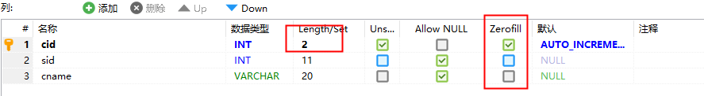
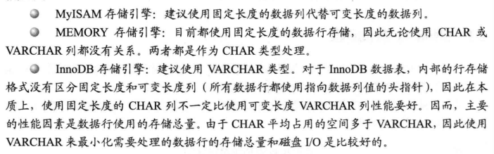

**数据类型**

在 MySQL中字段的数据类型有很多种，常见的可以分为几类，如：整型、浮点型、字符型、日期时间类型等。

## 整型

可以使用的整数类型有：TINYINT，SMALLINT，MEDIUMINT，INT，BIGINT。

分别使用   8、16、24、32、64位存储空间。存储范围从-2^(N-1)^ 到  2^(N-1)^ - 1，其中N是存储空间位数，一般情况下选择类型越小越好。

| 整数类型  | 字节 | 最小值                            | 最大值                                              |
| --------- | ---- | --------------------------------- | --------------------------------------------------- |
| TINYINT   | 1    | 有符号-128无符号0                 | 有符号127无符号255                                  |
| SMALLINT  | 2    | 有符号-32768无符号0               | 有符号32767无符号65535                              |
| MEDIUMINT | 3    | 有符号-8388608无符号0             | 有符号8388607无符号1677215                          |
| INT       | 4    | 有符号-2147483648无符号0          | 有符号21474836487无符号                             |
| BIGINT    | 8    | 有符号-9223372036854775808无符号0 | 有符号9223372036854775807无符号18446744073709551615 |

整数类型有可选的 unsigned 属性，表示不允许负值，可以使正数的上限提高一倍，例如：tinyint unsigned 范围是0~255，而tinyint 的存储范围是 128~127

整数类型可以指定宽度，如 int (n) ：n 表示 zerofill  状态下，显示的最少字符长度，当字符长度不满足要求时，会用“0”自动填充。与存储空间大小无关（int 都在4个字节长度），看下图的 cid 字段就可知了，

## 浮点型和定点数

FLOAT 和 DOUBLE 为浮点类型，DECIMAL 为高精度小数类型，常用于如，财务数据。

FLOAT、DOUBLE 和 DECIMAL 都可以指定列宽，例如 DECIMAL(18, 9) 表示总共 18 位，取 9 位存储小数部分，剩下 9 位存储整数部分。

## 日期和时间型

MySQL 提供了多种相似的日期时间类型，主要使用如下

* 表示年月日：通常使用 DATE
* 表示年月日时分秒：通常使用 DATETIME 和 TIMESTAMP
* 表示时分秒：通常使用 TIME

| 类型      | 字节 | 最小值              | 最大值              |
| --------- | ---- | ------------------- | ------------------- |
| YEAR      | 1    | 1901                | 2155                |
| TIME      | 3    | -838:59:59          | 838:59:59           |
| DATE      | 4    | 1000-01-01          | 9999-12-31          |
| TIMESTAMP | 4    | 1970-01-01 00:00:01 | 2038-01-19 03:14:07 |
| DATETIME  | 8    | 1000-01-01 00:00:00 | 9999-12-31 23:59:59 |

**DATETIME 和 TIMESTAMP区别**

**DATETIME：**

能够保存从 1001 年到 9999 年的日期和时间，精度为秒，使用 8 字节的存储空间。它与时区无关。

默认情况下，MySQL 以一种可排序的、无歧义的格式显示 DATETIME 值，例如“2008-01-16 22:37:08”，这是 ANSI 标准定义的日期和时间表示方法。

**TIMESTAMP：**

和 UNIX 时间戳相同，保存从 1970 年 1 月 1 日午夜(格林威治时间)以来的秒数，使用 4 个字节，只能表示从 1970 年 到 2038 年。它和时区有关，也就是说一个时间戳在不同的时区所代表的具体时间是不同的。

**最小值1970-01-01 00:00:01 通常和时区有关，一般需要加上8小时，如1970-01-01 08:00:01**

MySQL 提供了 FROM_UNIXTIME() 函数把 UNIX 时间戳转换为日期，并提供了UNIX_TIMESTAMP() 函数把日期转换为 UNIX 时间戳。

默认情况下，如果插入时没有指定 TIMESTAMP 列的值，会将这个值设置为当前时间。应该尽量使用 TIMESTAMP，因为**它比 DATETIME 空间效率更高**。

## 字符型

MySQL支持多种字符串类型，且每种类型还有很多变种。其中 varchar和char 为两种主要的类型

* char(N)：固定长度，当长度不够时自动填充至 n 个字符长度，最多255字符，占用N个字节。优点：不易产生空间碎片。
* varchar(N)：可变长度，比定长类型更省空间 ，需要1个或者2个字节表示长度（>=255时2个），最多65535字符，占用N+1个字节，优点：节省空间

CHAR 存储时MySQL会删除所有的末尾空格，varchar 不会（4.1 之前会）

## 字符集

字符，我们主要关注一下支持中文的区别，在支持中文时，GBK每个汉字占2个字节，UTF-8则需要3个字节

## 资料参考

* 深入浅出MySQL++数据库开发、优化与管理维护+第2版+唐汉明-6.pdf