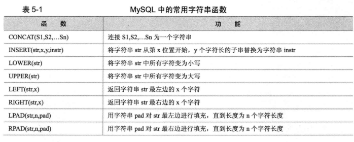
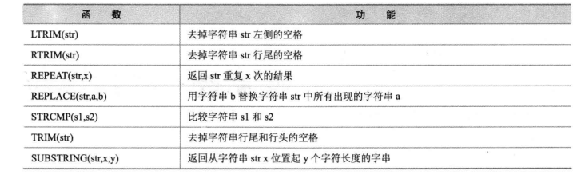
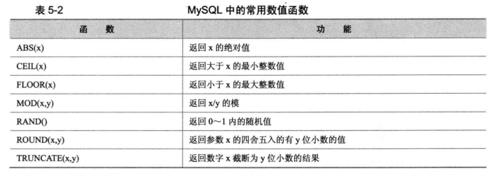
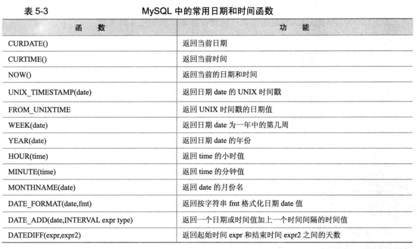
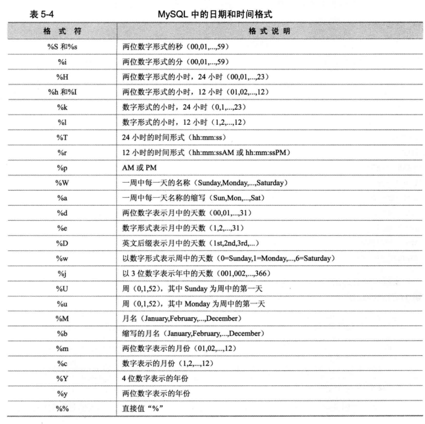

本章内容请原谅我懒，直接抠图。

## 字符串函数

字符串函数通常是我们使用最普遍的，如下：





## 数值函数



## 日期和时间函数




```SQL
-- 计算两个日期之间的时间间隔的方法
select TimeStampDiff(DAY,'2019-01-01','2019-02-03')
```

通常格式化时间表达式：**%Y-%m-%d %H:%i:%s**




## 资料参考

* 深入浅出MySQL++数据库开发、优化与管理维护+第2版+唐汉明-6.pdf