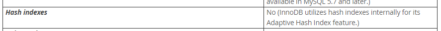

MySQL 中索引时我们进行数据库优化时最常用，也是最有效的手段之一。这里主要讨论一下索引的分类、存储、使用方法

# 索引的分类

在MySQL中通常有如下几类：

1. B-Tree：最常见的索引类型
2. HASH：只有Memory/Heap/NDB 支持
3. R-Tree(空间索引)：是MyISAM的一个特殊索引类型，用于地理空间数据类型，使用较少
4. Full-text(全文索引)：是MyISAM的一个特殊索引类型，用于全文索引，InnoDB从MySQL5.6版本开始支持

哈希索引 对于InnoDB来说，InnoDB在内部将哈希索引用于其自适应哈希索引功能，会根据表的使用情况自动为表生成哈希索引，因此不支持；

查看官方文档：https://dev.mysql.com/doc/refman/5.7/en/innodb-introduction.html ，我们可以找到




**B-Tree 索引和 Hash 索引比较**

1. B树索引可以在使用表达式中使用的对列的比较 [=](https://dev.mysql.com/doc/refman/5.7/en/comparison-operators.html#operator_equal)， [>](https://dev.mysql.com/doc/refman/5.7/en/comparison-operators.html#operator_greater-than)， [>=](https://dev.mysql.com/doc/refman/5.7/en/comparison-operators.html#operator_greater-than-or-equal)， [<](https://dev.mysql.com/doc/refman/5.7/en/comparison-operators.html#operator_less-than)， [<=](https://dev.mysql.com/doc/refman/5.7/en/comparison-operators.html#operator_less-than-or-equal)，或[BETWEEN](https://dev.mysql.com/doc/refman/5.7/en/comparison-operators.html#operator_between)，包括[LIKE](https://dev.mysql.com/doc/refman/5.7/en/string-comparison-functions.html#operator_like)是不以通配符开头的常量字符串，则索引也可以用于比较 
2. 哈希索引仅用于使用=、<=> 运算符的相等比较 （但*非常*快），但不能用于范围查询
3. MySQL无法确定两个值之间大约有多少行（范围优化器使用它来决定使用哪个索引）。如果将MyISAM或 InnoDB表更改为哈希索引MEMORY表，这可能会影响某些查询。
4. 哈希索引仅整个键可用于搜索行。（对于B树索引，键的任何最左边的前缀都可用于查找行。）


# 索引使用场景

## 索引典型场景

1. 全值匹配
2. 范围查询
3. 最左匹配原则
4. 覆盖索引
5. 前缀索引
6. 索引列使用is null


## 不能使用索引的场景

1. 以%开头的LIKE查询不能够利用 B-Tree 索引。可采用全文索引解决此问题
2. 隐式转换也不会使用索引，特别注意当列是字符串，那么常量值一定要用引号，否则无法使用该列上的索引
3. 复合索引的情况下，当不满足最左原则时也不会使用复合索引
4. 如果使用索引比全表更慢，也不会使用索引
5. 使用or时，如果前面的列有索引，后面的列没有，那么所涉及的索引都不会被用到


# 查看索引使用情况

**1、查询当前索引使用情况**

SHOW STATUS LIKE 'Handler_read%';

* Handler_read_first：代表读取索引头的次数，如果这个值很高，说明全索引扫描很多。
* Handler_read_key：代表一个索引被使用的次数，如果我们新增加一个索引，可以查看Handler_read_key是否有增加，如果有增加，说明sql用到索引。
* Handler_read_next：代表读取索引的下列，一般发生range scan。
* Handler_read_prev：代表读取索引的上列，一般发生在ORDER BY … DESC。
* Handler_read_rnd：代表在固定位置读取行，如果这个值很高，说明对大量结果集进行了排序、进行了全表扫描、关联查询没有用到合适的KEY。
* Handler_read_rnd_next：代表进行了很多表扫描，查询性能低下。

**2、查看索引是否被使用到**

```sql
SELECT  object_type, object_schema, object_name, index_name, count_star, count_read, COUNT_FETCH FROM PERFORMANCE_SCHEMA.table_io_waits_summary_by_index_usage;
```

如果read,fetch的次数都为0的话，就是没有被使用过的。

**3、查看SQL用到了什么索引**

可以使用explain，从最好到最差依次是：system > const > eq_ref > ref > fulltext > ref_or_null > index_merge > unique_subquery > index_subquery > range > index > ALL