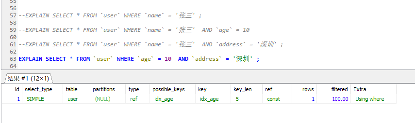
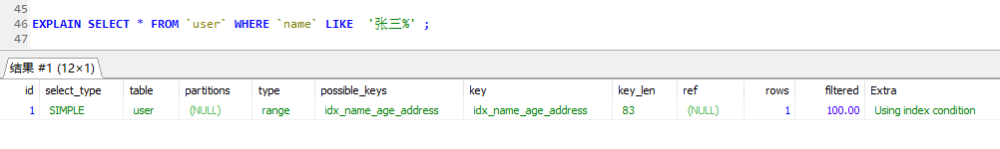
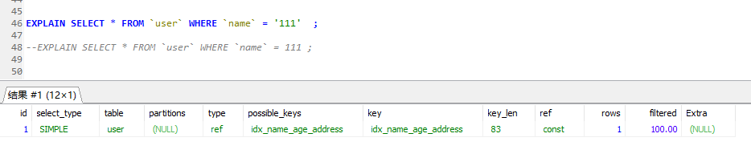
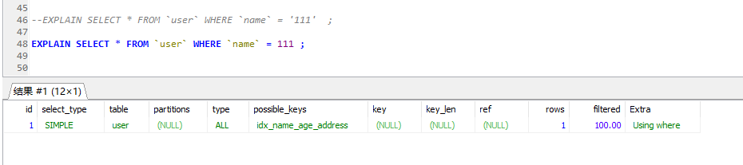
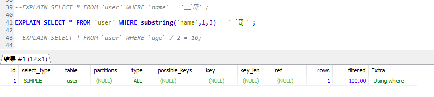
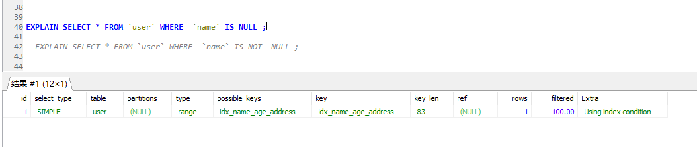
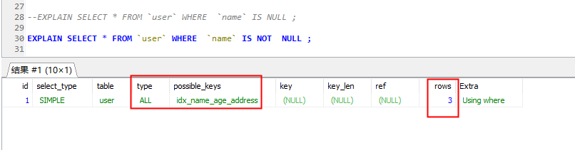
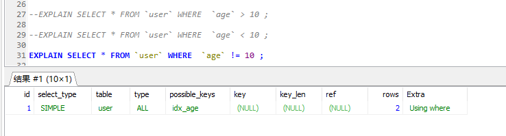
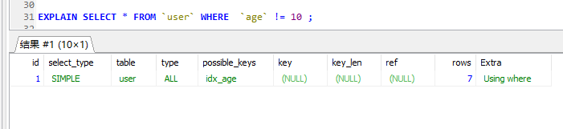

# SQL 的执行顺序

要想优化MySQL的查询语句，必须先了解查询 SQL 的执行顺序

一个完整的Query SQL，如下：

```sql
select distinct 
    <select_list>
from
    <left_table><join_type>  
join  <right_table> on <join_condition>
where
    <where_condition>
group by
    <group_by_list>
having
    <having_condition>
order by
    <order_by_condition>
limit <limit number>
```

SQL执行顺序如下：

>   1、from <left_table><join_type>
>
>   2、on <join_condition>
>
>   3、<join_type> join <right_table>
>
>   4、where <where_condition>
>
>   5、group by <group_by_list>
>
>   6、having <having_condition>
>
>   7、select
>
>   8、distinct <select_list>
>
>   9、order by <order_by_condition>
>
>   10、limit <limit_number>


# 常见优化方案

在遵循 MySQL 数据库表结构设计规约和MySQL 索引设计规约的情况下，对慢查询进行优化

## 脚本规范优化

>   禁止使用 select * 方式，必须使用SELECT <字段列表> 查询
>
>   禁止使用不含字段列表的INSERT语句，如：insert into values ('a','b','c');
>
>   禁止使用order by rand() 进行随机排序
>
>   只需要查询一行数据时使用 LIMIT 1
>
>   充分利用表上已经存在的索引，并遵循最左前缀原则
>
>   避免使用 join 关联太多的表
>
>   对应同一列进行or判断时，使用in代替 or
>
>   在明显不会有重复值时使用 union all 而不是 union
>
>   拆分复杂的大SQL为多个小SQL


**避免使用JOIN关联太多的表**

在Mysql中，对于同一个SQL多关联（join）一个表，就会多分配一个关联缓存，如果在一个SQL中关联的表越多，所占用的内存也就越大。容易造成服务器内存溢出的情况；Mysql最多允许关联61个表，建议不超过5个。


**对应同一列进行or判断时，使用in代替or**

in的值不要超过500个in操作可以更有效的利用索引，or大多数情况下很少能利用到索引。

建议控制 in 的个数在200内

建议改为 inner join 查询，或者使用 union 使用连接（join）来代替子查询，或者尽量少用JOIN 查询，尽量单表查询

因为执行子查询时，MYSQL需要创建临时表，查询完毕后再删除这些临时表。


## 索引失效情况

>   最左前缀原则导致失效
>
>   模糊查询导致失效
>
>   隐式转换导致失效
>
>   OR 或 IN 导致失效
>
>   函数运算导致失效
>
>   NULL 值判断导致失效
>
>   不等号、大于小于号导致失效
>
>   全表查比索引查效率高
>
>   连接查询中，按照优化器顺序的第一张表不会走索引


下面我们便使用 explain 分析一下

当前环境，MySQL 版本 8.0，引擎 InnoDB

 这里创建 2 个表 user 和 job ，具体数据表结构如下：

```sql
DROP TABLE IF EXISTS `user`;
CREATE TABLE `user` (
	`id` INT(11) NOT NULL AUTO_INCREMENT,
	`name` VARCHAR(20) NULL DEFAULT NULL,
	`sex` VARCHAR(50) NULL DEFAULT NULL,
	`age` INT(4) NULL DEFAULT NULL,
	`address` VARCHAR(50) NULL DEFAULT NULL,
	PRIMARY KEY (`id`) USING BTREE,
	INDEX `idx_sex` (`sex`) USING BTREE,
	INDEX `idx_age` (`age`) USING BTREE,
	INDEX `idx_name_age_address` (`name`, `age`, `address`) USING BTREE
)
COLLATE='utf8mb4_0900_ai_ci'
ENGINE=InnoDB;
```


### **最左前缀原则导致失效**

这里测试 `user` 表的 `idx_name_age_sex` 索引




有上图可以看出，**最左前缀原则是指在联合索引中，第一个索引列，必须存在**，否则无法使用该联合索引

**为什么是这种规则呢？**

因为 B+ 树的结构是复合型数据结构，必须按照从左到右的顺序建立树，如果没有第一列，就不知道该怎么找到节点。


### 模糊查询导致失效



由上图可知在 where 子查询条件中，模糊查询 like 在使用 '%' 时，出现的位置不同，索引效果不同，很明显：模糊查询中，使用后缀查询会是索引失效，但可以使用前缀查询。

不过，在实际开发中前缀模糊查询的方式往往不能满足需求


### 隐式转换导致失效

隐式转换是指查询条件中的索引列的类型和查询条件值得类型不一致，而发生了隐式转换。

一般指，数字转换为字符串的情况





有上图可以看出，在  `name = 111` 的条件中，虽然找到了  `idx_name_age_sex` 索引，但key 列为空，索引并没有被使用


### OR 或 IN 导致失效


通过上图我们可以非常诧异！！ 为什么？网络上不是说 IN 或 NOT IN 会导致索引失效吗？

不要惊慌，以上测试，我们的 `idx_name_age_address` 采用的BTREE 算法，

如果我们换成 HASH 算法呢？

结果还是一下...

所以，总结一下：在 MySQL 8.0 ，引擎为 InnoDB 的条件下，IN 或者 NOT IN 在使用索引才行时，无论采用 BTREE 还是 HASH 算法，索引都不会失效

那其他版本了，我从 5.6.43-log 、5.7.27 版本中又测试了一下，发现在MySQL 5.6 版本中，IN 和 NOT IN 是无法使用索引的


**个人认为，在在MySQL 5.6 版本和其以下版本中，IN 和 NOT IN 才会无法使用索引的**


**对应 OR 的情况：**


由上图可以看出， **or 是使索引失效，指的是 or 两边不同列的情况。**

对于这种失效情况，我们可以使用覆盖索引进行优化，如下：


所查出的列全都属于 `idx_name_age_address` 索引的列。

建议：使用 IN 代替 OR 查询


### 函数运算导致失效

在where子句中，索引列参与到函数计算时索引会失效





由上图可见，当我们将索引列 进行函数运算时，索引将会失效；

在实际开发中，我们最常见的就是对日期、时间字段进行转换了，千万不要在这类字段上使用函数，否则会索引失效，如下：

反例：

```sql
where date(create_time)='2019-01-01'
```

推荐：

```sql
where create_time > date_format('2019-01-01 12:12:12','%Y-%m-%d')
--或者
where create_time <= '2019-01-01 00:00:00'  and create_time > '2019-01-01 23:59:59' 
```


### NULL 值判断导致失效




通过上图我们可以发现 IS NULL 或 IS NOT NULL 不会导致索引失效

这里我们可以思考一下，这是不是也如同 IN 的效果一样呢？是与版本有关

在 5.6.46-log 版本中， IS NULL 是会走索引的，但是  IS NOT NULL 出现了特别的结果

当 name 字段为 NULL 数据条数在2条内，索引依然有效，超过2条索引会失效， NOT NULL 也存在相同的规则，

如下，数据条数在2条内：




 MySQL 5.7 同样存在此问题。但 5.8 不会出现这情况。不过这是为什么呢？下面有篇文章解释的非常不错

https://mp.weixin.qq.com/s/CEJFsDBizdl0SvugGX7UmQ


**总结：在MySQL 5.8 版本中，IS NULL 和 IS NOT NULL 不会使索引失效，但 MySQL 5.6,5.7 索引不一定会失效，因为可能全表查比索引查效率更高**


### 不等号、大于小于号导致失效


在MySQL 5.8 版本 ，不等号、大于小于号不会导致索引失效，但是在5.6，5.7 版本中 “!=”  ，也会因为数据量不同，效果不同，如下：






**总结：**

**在MySQL 5.8 版本中，不等号 、大于小于号不会使索引失效，**

**但 MySQL 5.6,5.7 中 大于小于号不会使索引失效 ，但不等号索引不一定会失效，因为可能全表查比索引查效率更高**

