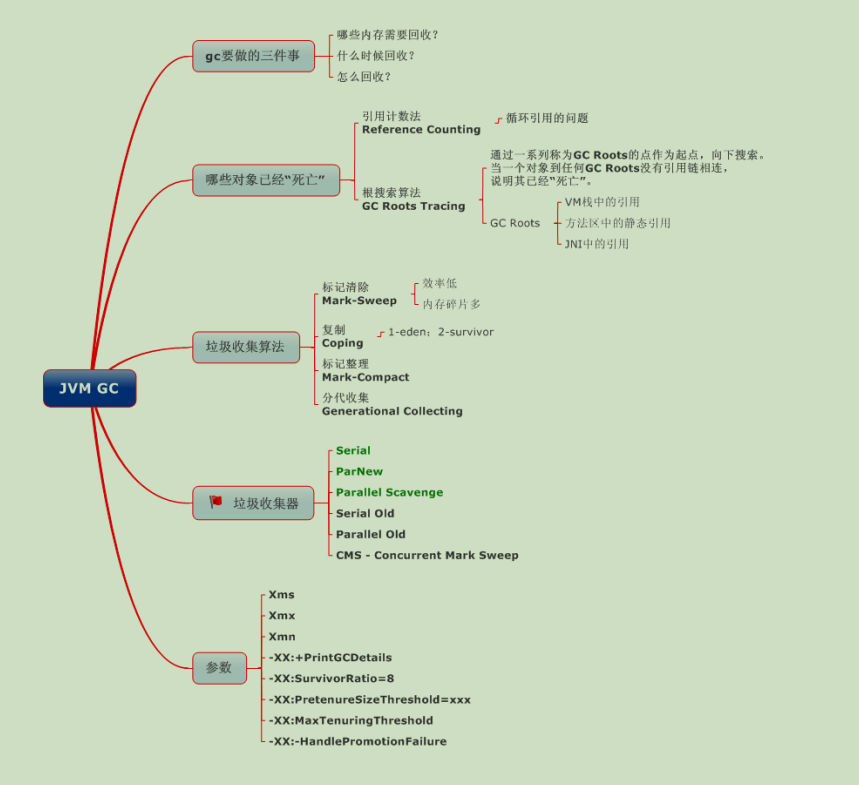
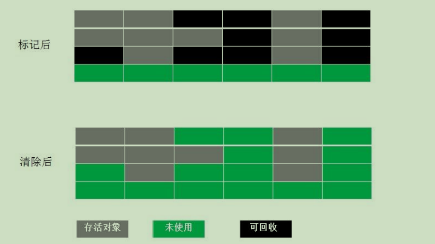
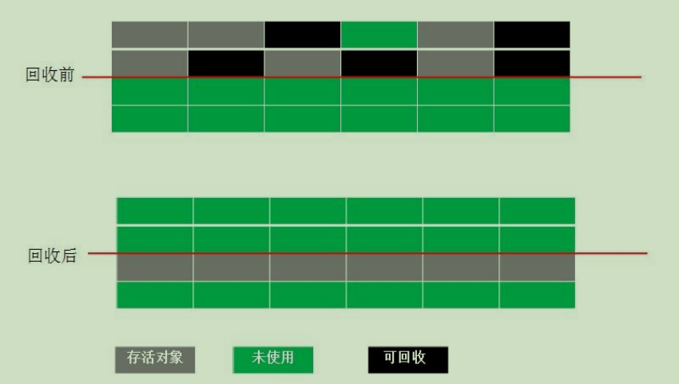
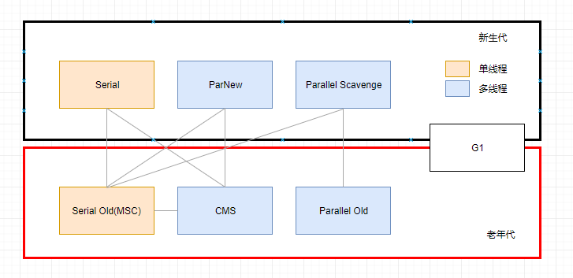

以下图片引用他人，已忘记从哪拷贝，如图片作者需特殊说明，请联系...

在 JVM 中 GC 的回收机制也是非常重要的一块，废话不多说，先上张图

# 如何确定垃圾

**1. 引用计数法**

每个对象有一个引用计数属性，新增一个引用时计数加1，引用释放时计数减1，计数为0时可以回收。此方法简单，无法解决对象相互循环引用的问题。

**2.**  **可达性分析**

为了解决引用计数法的循环引用问题，Java 使用了可达性分析的方法。通过一系列的`GC roots`对象作为起点搜索。**如果在`GC roots`和一个对象之间没有可达路径，则称该对象是不可达的**。

要注意的是，**不可达对象不等价于可回收对象**，不可达对象变为可回收对象**至少要经过两次标记过程**。两次标记后仍然是可回收对象，则将面临回收。

## **GC对象标记过程**

**第一次标记：**

*   如果对象在可达性分析后没有与GC Roots相连接的引用链，将**第一次被标记**，并进行一次筛选，筛选条件为**是否有必要执行finalize()方法**，
*   没有必要执行finalize()方法，便将这对象**放置F-Queue队列**中，并在稍后由一个虚拟机自动建立的、低优先级的Finalizer线程去执行它（指触发这个方法）；
*   "没必要执行"的两种情况：**当对象没有覆盖finalize()**，或者此方法**已经被虚拟机调用过**

**第二次标记：**

*   稍后GC将对F-Queue中的对象进行**第二次标记**，如果对象在finalize()方法中成功拯救自己（重新与引用链上的任一对象建立关联），它将被移出“即将回收”集合，否则，被回收

## GC Roots的对象

*   虚拟机栈中引用的对象、
*   方法区中类静态属性
*   常量的引用的对象、
*   本地方法栈中JNI（native接口）引用的对象。

**总结**：

*   根据向下搜索方法判断引用链不可达 
*   再判断是否有必要执行finalize()方法，
*   没有必要执行，进入f-queue队列 
*   再次判断与GCRoot有链接 
*   没有回收

# 对象引用关系

无论通过引用计数算法还是可达性分析算法，来判读对象是否存活，都与引用相关；

引用分：**强引用、软引用、弱引用、虚引用；引用强度依次减弱**

*   强引用：**永远不会被回收**，类似“Object obj = new Object()”的引用，强引用是造成 Java 内存泄漏的主要原因之一
*   软引用： **内存不足回收** ，用来描述一些还有用但是并非必须的对象， 通过SoftReference类实现
*   弱引用： **只能生存到下一次垃圾收集之前**，只要垃圾回收机制一运行，不管 JVM 的内存空间是否足够，总会回收该对象占用的内存。 用来描述非必须的对象，通过WeakReference类实现，
*   虚引用： **无影响**，无法通过虚引用获取对象实例，其目的为了能在对象被回收时收到一个系统通知，通过PhantomReference类实现

# GC 算法

共有 4 种：**标记-清除算法、复制算法、标记-整理算法、分代收集算法**

## 标记-清除算法

*   算法分为“标记”和“清除”两个阶段
*   缺点：效率不高，**产生大量不连续的内存碎片**

## 复制算法

为了解决 Mark-Sweep 算法内存碎片化的缺陷而被提出的算法。按内存容量将内存划分为等大小

的两块。每次只使用其中一块，当这一块内存满后将尚存活的对象复制到另一块上去，把已使用

的内存清掉

*   内存效率高，不易产生碎片，当大量存活对象时会进行较多次复制操作，效率大大降低。
*   **需要分配担保**：survivor空间不足时，需要老年代进行分配担保，来保证所有对象有存活的情况
*   **gc过程简单，运行高效** ,不需要考虑内存碎片等复杂情况

## 标记-整理算法

结合了以上两个算法，为了避免缺陷而提出。标记阶段和 Mark-Sweep 算法相同，标记后不是清

理对象，而是将存活对象移向内存的一端。然后清除端边界外的对象

## 分代收集算法

分代收集法是目前大部分 JVM 所采用的方法，其核心思想是根据对象存活的不同生命周期将内存划分为不同的域，一般情况下将 GC 堆划分为**老生代**(Tenured/Old Generation)和**新生代**(Young Generation)。

**老生代的特点：是每次垃圾回收时只有少量对象需要被回收，**

**新生代的特点：是每次垃圾回收时都有大量垃圾需要被回收，**

因此可以根据不同区域选择不同的算法。

**新生代与复制算法**

​		目前大部分 JVM 的 GC 对于新生代都采取 Copying 算法，**因为新生代中每次垃圾回收都要回收大部分对象，即要复制的操作比较少**，但通常并不是按照 1：1 来划分新生代。一般将新生代划分为一块较大的 Eden 空间和两个较小的 Survivor 空间(From Space, To Space)，每次使用Eden 空间和其中的一块 Survivor 空间，当进行回收时，将该两块空间中还存活的对象复制到另一块 Survivor 空间中。

**老年代与标记复制算法**

​		老年代因为每次只回收少量对象，因为对象存活率高、没有额外空间对它进行分配担保, 就必须采用“标记—清理”或“标记—整理”算法来进行回收, 不必进行内存复制, 且直接腾出空闲内存.

1.  JAVA 虚拟机提到过的处于方法区的永生代(Permanet Generation)，它用来存储 class 类，常量，方法描述等。对永生代的回收主要包括废弃常量和无用的类。

2.  对象的内存分配主要在新生代的 Eden Space 和 Survivor Space 的 From Space(Survivor 目前存放对象的那一块)，少数情况会直接分配到老生代。

3.  当新生代的 Eden Space 和 From Space 空间不足时就会发生一次 GC，进行 GC 后，Eden Space 和 From Space 区的存活对象会被挪到 To Space，然后将 Eden Space 和 From Space 进行清理。

4.  如果 To Space 无法足够存储某个对象，则将这个对象存储到老生代。

5.  在进行 GC 后，使用的便是 Eden Space 和 To Space 了，如此反复循环。

6.  当对象在 Survivor 区躲过一次 GC 后，其年龄就会+1。默认情况下年龄到达 15 的对象会被移到老生代中。

## **分区收集算法**

分区算法则将整个堆空间划分为连续的不同小区间, 每个小区间独立使用, 独立回收.

这样做的好处是可以控制一次回收多少个小区间 , 根据目标停顿时间, 每次合理地回收若干个小区间(而不是整个堆), 从而减少一次 GC 所产生的停顿。

# 垃圾收集器

## Serial **垃圾收集器（单线程、复制算法）**

​		Serial 垃圾收集器虽然在收集垃圾过程中需要暂停所有其他的工作线程，但是它简单高效，对于限定单个 CPU 环境来说，没有线程交互的开销，可以获得最高的单线程垃圾收集效率，

​		因此 Serial垃圾收集器依然是 java 虚拟机运行在 Client 模式下**默认的新生代垃圾收集器**。

## ParNew 垃圾收集器（Serial+多线程）

​		ParNew 垃圾收集器其实**是 Serial 收集器的多线程版本**

​		ParNew 收集器默认开启和 CPU 数目相同的线程数，可以通过-XX:ParallelGCThreads 参数来限制垃圾收集器的线程数。【Parallel：平行的】，是很多 java虚拟机运行在 Server 模式下新生代的默认垃圾收集器。

## Parallel Scavenge 收集器（多线程复制算法、高效）

​		是一个新生代垃圾收集器，同样使用复制算法，也是一个多线程的垃圾收集器，

​		它**重点关注的是程序达到一个可控制的吞吐量**（Thoughput，CPU 用于运行用户代码的时间/CPU 总消耗时间，即吞吐量=运行用户代码时间/(运行用户代码时间+垃圾收集时间)），高吞吐量可以最高效率地利用 CPU 时间，尽快地完成程序的运算任务，

主要适用于在后台运算而不需要太多交互的任务。自适应调节策略也是 ParallelScavenge 收集器与 ParNew 收集器的一个重要区别。

## Serial Old 收集器（单线程标记整理算法 ）

​		**Serial Old 是 Serial 垃圾收集器年老代版本，它同样是个单线程的收集器**，使使用标记-整理算法，这个收集器也主要是运行在 Client 默认的 java 虚拟机默认的年老代垃圾收集器。

## Parallel Old 收集器（多线程标记整理算法）

Parallel Old 收集器是Parallel Scavenge的年老代版本

Parallel Old 正是为了在年老代同样提供吞吐量优先的垃圾收集器，如果系统对吞吐量要求比较高，可以优先考虑新生代 Parallel Scavenge和年老代 Parallel Old 收集器的搭配策略。

## CMS 收集器（多线程标记清除算法）

Concurrent mark sweep(CMS)收集器是一种年老代垃圾收集器，其**最主要目标是获取最短垃圾回收停顿时间**，和其他年老代使用标记-整理算法不同，它使用**多线程的标记-清除算法**。最短的垃圾收集停顿时间可以为交互比较高的程序提高用户体验。

**优点**：并发收集、低停顿；

**缺点**：对CPU资源非常敏感，无法清除浮动垃圾，产生大量空间碎片；标记 - 清除算法导致的空间碎片，往往出现老年代空间剩余，但无法找到足够大连续空间来分配当前对象，不得不提前触发一次 Full GC

CMS 工作机制相比其他的垃圾收集器来说更复杂，整个过程分为以下 4 个阶段：

*   **初始标记：**只是标记一下 GC Roots 能直接关联的对象，速度很快，仍然需要暂停所有的工作线程。
*   **并发标记：**进行 GC Roots 跟踪的过程，和用户线程一起工作，不需要暂停工作线程。
*   **重新标记：**为了修正在并发标记期间，因用户程序继续运行而导致标记产生变动的那一部分对象的标记记录，仍然需要暂停所有的工作线程。
*   **并发清除：**清除 GC Roots 不可达对象，和用户线程一起工作，不需要暂停工作线程。由于耗时最长的并发标记和并发清除过程中，垃圾收集线程可以和用户现在一起并发工作，所以总体上来看CMS 收集器的内存回收和用户线程是一起并发地执行。

## G1 收集器

Garbage first 垃圾收集器是目前垃圾收集器理论发展的最前沿成果，相比与 CMS 收集器，G1 收集器两个最突出的改进是：

1.  基于标记-整理算法，**不产生内存碎片。**

2.  可以非常精确控制停顿时间，**在不牺牲吞吐量前提下，实现低停顿垃圾回收**。

**G1 收集器避免全区域垃圾收集，它把堆内存划分为大小固定的几个独立区域，并且跟踪这些区域的垃圾收集进度，同时在后台维护一个优先级列表，每次根据所允许的收集时间，优先回收垃圾最多的区域。**

**区域划分和优先级区域回收机制，确保 G1 收集器可以在有限时间获得最高的垃圾收集效率。整体基于标记整理算法，局部region之间基于复制算法**

**特点：并行与并发、分代收集、空间整合、可预测的停顿**

整个过程分为 4 个阶段：初始标记、并发标记、最终标记、筛选回收

**整理上：响应优先选择CMS，吞吐量高选择G1**

#  JVM启动参数

**-Xmx** ：设置最大堆容量

**-Xms** ：设置初始堆容量

**-Xmn** ：新生代大小

**-Xss** ：参数设定每个线程的栈大小

-XX:newRatio ：新生代与老年代的比例

-XX:SurvivorRatio ：Eden区与Survivor的比例

-XX:PermSize ：永久代的初始大小

-XX:MaxPermSize ：永久代的最大空间

-XX:MaxTenuringThreshold：设置垃圾最大年龄

-XX:MaxDirectMemorySize  ：直接内存，如果不指定与Xmx  一样

**在线上生产环境，JVM 的 Xms 和 Xmx 设置一样大小的内存容量，避免在 GC 后调整 堆大小带来的压力**

Eclipse Memory Analyzer：Eclipse 插件，Java内存分析器，可帮助您查找内存泄漏并减少内存消耗。

