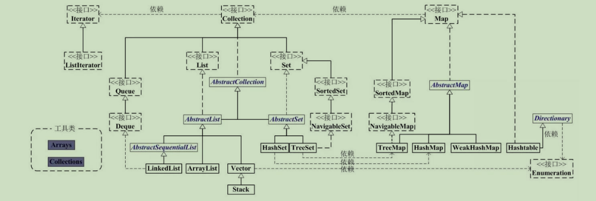

在 Java 中，集合类是一个用来存放对象的容器，它们都存放于 `java.util` 包中，

主要有 3 种：set(集）、list(列表包含 Queue）和 map(映射)。

1.  Collection：Collection 是集合 List、Set、Queue 的最基本的接口。

2.  Map：是映射表的基础接口
3.  Iterator：迭代器，可以通过迭代器遍历集合中的数据




## Collection 接口

*   **List** ：在 Java 的 List 是非常常用的数据类型。**List 是有序的 Collection**。Java List 一共三个实现类：分别是 `ArrayList`、`Vector` 和 `LinkedList`。

*   **Set**：注重独一无二的性质，**值不能重复**。用于存储无序元素，存入和取出的顺序不一定相同；但凡是都有例外，TreeSet(自然序) 和 LinkedHashSet(插入顺序) 就是有序的；**如果想要让两个不同的对象视为相等的，就必须覆盖 Object 的 hashCode 方法和 equals 方法。**

*   **Queue**：队列，具备先进先出或者先进后出的特点；常见**LinkedList**：可以用它来实现双向队列。**PriorityQueue**：基于堆结构实现，可以用它来实现优先队列。


## Map 接口

Map 是通过键值对存储，其键名唯一，键值可重复


## Iterator

Collection 继承了 Iterable 接口，其中的 iterator() 方法能够产生一个 Iterator 对象，通过这个对象就可以迭代遍历 Collection 中的元素。

从 JDK 1.5 之后可以使用 foreach 方法来遍历实现了 Iterable 接口的聚合对象。

**特点**：

*   迭代遍历过程中，禁止改变容器大小，如：add、remove操作，会抛出`ConcurrentModificationException`异常
*   快速失败机制（fail-fast）：当多个线程对Collection进行操作时，若其中某一个线程通过 Iterator 遍历集合时，该集合的内容被其他线程所改变，则会抛出`ConcurrentModificationException`异常。

### Fail-Fast 原因

*   是迭代器在遍历时直接访问集合中的内容，并且在遍历过程中使用一个 modCount 变量（用来记录 ArrayList 结构发生变化的次数）。集合在被遍历期间如果内容发生变化，就会改变 modCount 的值。
*   结构发生变化是指添加或者删除至少一个元素的所有操作，或者是调整内部数组的大小，仅仅只是设置元素的值不算结构发生变化。
*   每当迭代器使用 hashNext()/next() 遍历下一个元素之前，都会检测 modCount 变量是否为 expectedModCount 值，是的话就返回遍历；否则抛出异常，终止遍历。


### 快速失败（fail-fast）和安全失败（fail-safe）

*   HashMap、ArrayList 这些集合类，这些在 java.util 包的集合类就都是快速失败的；而 `java.util.concurrent` 包下的类都是安全失败，比如：ConcurrentHashMap。
*   快速失败在遍历时`直接访问`集合中的内容
*   安全失败在遍历时不是直接在集合内容上访问的，而是`先复制`原有集合内容，在拷贝的集合上进行遍历。


**快速失败（fail-fast）解决办法**

*   通过`java.util.concurrent`集合包下的相应类（`CopyOnWriteArrayList`是自己实现Iterator）去处理，则不会产生`fast-fail`事件。
*   `CopyOnWriteArrayList`类是复制了数组，不是直接操作原数组


### for与foreach的对比

*   **foreach使用的是迭代器循环，for是使用索引下标检索**
*   需要**循环数组结构**的数据时，建议**使用普通for循环**，因为for循环采用下标访问，对于数组结构的数据来说，采用下标访问比较好。
*   需要**循环链表结构**的数据时，**一定不要使用普通for循环**，这种做法很糟糕，数据量大的时候有可能会导致系统崩溃。

```java
//使用方式
Iterator it = list.iterator();
while(it.hasNext()){
　Object obj= it.next();
}
```

**Iterator 接口包含 4 个方法**

```java
E next ( ) ;
boolean hasNext ();
void remove () ;
default void forEachRemaining ( Consumer < ? super E > action ) ;
```

## 多线程下的集合安全

由于集合大多数是线程不安全的，可采用如下方式处理

*   使用加锁机制：synchronized、Lock
*   使用 volalite 修饰
*   使用 ThreadLocal 对象
*   使用集合工具类 Collections，通过如下方法操作，常用有：`synchronizedCollection`、`synchronizedList(List list)`、`synchronizedMap(Map m)`、`synchronizedSet(Set s)`
*   使用`java.util.concurrent`提供的并发集合对象，其提供了映射 、 有序集和队列的高效实现 ，常用有：**ConcurrentHashMap**、**CopyOnWriteArrayList**、**CopyOnWriteArraySet**、`ConcurrentSkipListMap（SkipList：跳表）`、`ConcurrentSkipListSet`、`ConcurrentLinkedQueue`

注释 ： 有些应用使用庞大的并发散列映射 ， 这些映射太过庞大 ， 以至于无法用 size 方法得到它的大小，因为这个方法只能返回 int。 对于一个包含超过20 亿条目的映射该如何处理 **JavaSE 8 引入了一个 mappingCount 方法可以把大小作为 long 返回。**


