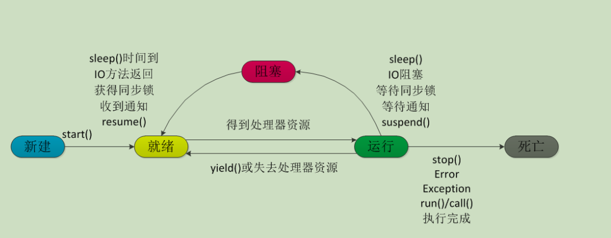

# 线程实现方式

**线程的实现有 3 种方式，如下：**

* 继承 Thread 类
* 实现 Runnable 接口
* 实现 Callable 接口

## Thread 和Runnable实现

直接示例说明

```java
//1、继承 Thread 类
public class MyThread extends Thread {
    public void run() {
        System.out.println("MyThread.run()");
    }
}

//2、实现 Runnable 接口
public class MyThread implements Runnable {
    public void run() {
        System.out.println("MyThread.run()");
    }
}

// 启动
MyThread myThread = new MyThread();
myThread.start();

```

实现接口比继承 Thread 类具有优势，因为接口是多实现， Thread 类单继承


## Callable 实现

有返回值的任务必须实现 Callable 接口，类似的，无返回值的任务必须 Runnable 接口。执行Callable 任务后，可以获取一个 Future 的对象，在该对象上调用 get 就可以获取到 Callable 任务返回的 Object 了，再结合线程池接口ExecutorService 就可以实现传说中有返回结果的多线程了。

```java
// 创建一个线程池
ExecutorService executor = Executors.newFixedThreadPool(2);
//创建一个Callable，3秒后返回String类型
Callable myCallable = new Callable() {
    @Override
    public String call() throws Exception {
    　　Thread.sleep(3000);
    　　System.out.println("calld方法执行了");
    　　return "call方法返回值";
    }
};
System.out.println("提交任务之前 "+LocalDatetime.now());
Future future = executor.submit(myCallable);
System.out.println("提交任务之后，获取结果之前 "+LocalDatetime.now());
System.out.println("获取返回值: "+future.get());
System.out.println("获取到结果之后 "+ LocalDatetime.now());
// 关闭线程池
pool.shutdown();

输出：
提交任务之前 12:13:01
提交任务之后，获取结果之前 12:13:01
calld方法执行了
获取返回值: call方法返回值
获取到结果之后 12:13:04
```

**get()方法的阻塞性：**在调用submit提交任务之后，主线程运行到future.get()的时，会发生阻塞，一直到任务执行完毕，拿到了返回的返回值，主线程才会继续运行。这里注意一下，他的阻塞性是因为调用get()方法时，任务还没有执行完，所以会一直等到任务完成，形成了阻塞。任务是在调用submit方法时就开始执行了，如果在调用get()方法时，任务已经执行完毕，那么就不会造成阻塞。

**设置超时时间**

```java
future1.get(3, TimeUnit.SECONDS)
```

## Callable和Runnable区别

执行方法不同；Callable的执行体 call() 方法可以返回值和抛出异常 ，通过 Future 对象进行封装


# 线程生命周期(状态)

在线程的生命周期中，它要经过新建(New)、就绪（Runnable）、运行（Running）、阻塞(Blocked)和死亡(Dead)5 种状态。

* **新建状态（NEW）**：当程序使用 new 关键字创建了一个线程之后，该线程就处于新建状态，此时仅由 JVM 为其分配内存，并初始化其成员变量的值
* **就绪状态（RUNNABLE）**：当线程对象调用了 start()方法之后，该线程处于就绪状态。Java 虚拟机会为其创建方法调用栈和程序计数器，等待调度运行。
* **运行状态（RUNNING）**：如果处于就绪状态的线程获得了 CPU，开始执行 run()方法的线程执行体，则该线程处于运行状态。
* **阻塞状态（BLOCKED）**：阻塞状态是指线程因为某种原因放弃了 cpu 使用权，也即让出了 cpu timeslice，暂时停止运行。直到线程进入可运行(runnable)状态，才有机会再次获得 cpu timeslice 转到运行(running)状态。阻塞的情况分三种
* **线程死亡（DEAD）**：线程会以三种方式结束，结束后就是死亡状态。


# 线程方法

## 常见方法

线程相关的基本方法有 Object（wait，notify，notifyAll），Thread（sleep，join，yield，interrupt等） 

### wait

线程等待；调用该方法的线程进入 WAITING 状态，只有等待另外线程的通知或被中断才会返回，需要注意的是调用 wait()方法后，**会释放对象的锁**。因此，wait 方法一般用在同步方法或同步代码块中。

### notify

线程唤醒；Object 类中的 notify() 方法，**随机唤醒在此对象监视器上等待的单个线程**；

线程通过调用其中一个 wait() 方法，在对象的监视器上等待，直到当前的线程放弃此对象上的锁定，才能继续执行被唤醒的线程，被唤醒的线程将以常规方式与在该对象上主动同步的其他所有线程进行竞争。

类似的方法还有 notifyAll() ，唤醒再次监视器上等待的所有线程。

### notifyAll

唤醒在此对象监视器上等待的所有线程

### sleep

线程睡眠；sleep 导致当前线程进行休眠，与 wait 方法不同的是 sleep 不会释放当前占有的锁，sleep(long)会导致线程进入 TIMED-WATING 状态，而 wait()方法会导致当前线程进入 WATING 状态

### join

线程等待， join() 方法，等待其他线程终止，在当前线程中调用一个线程的 join() 方法，则当前线程转为阻塞状态，回到另一个线程结束，当前线程再由阻塞状态变为就绪状态，等待 cpu 的宠幸。

**为什么要用 join()方法：**很多情况下，主线程生成并启动了子线程，需要用到子线程返回的结果，也就是需要主线程需要在子线程结束后再结束，这时候就要用到 join() 方法。

### yield

线程让步；yield() 会使当前线程让出 CPU 执行时间片，然后重新与其他线程一起竞争 CPU 时间片。

一般情况下，优先级高的线程有更大的可能性成功竞争得到 CPU 时间片，但这又不是绝对的，有的操作系统对线程优先级并不敏感。

### interrupt

中断一个线程，其本意是给这个线程一个通知信号，会影响这个线程内部的一个中断标识位。这个线程本身并不会因此而改变状态(如阻塞，终止等)。

**特点**：

1. **调用 interrupt()方法并不会中断一个正在运行的线程**。也就是说处于 Running 状态的线程并不会因为被中断而被终止，仅仅改变了内部维护的中断标识位而已。
2. **阻塞状态下使用，会抛异常**：如使用了 sleep，同步锁的 wait,socket 中的 receiver，accept 等方法时，会使线程处于阻塞状态。当调用线程的 interrupt()方法时，会抛出 InterruptException 异常。阻塞中的那个方法抛出这个异常，通过代码捕获该异常
3. **异常是返回 false**：许多声明抛出 InterruptedException 的方法(如 Thread.sleep(long mills 方法))，抛出异常前，都会清除中断标识位，所以抛出异常后，调用 isInterrupted()方法将会返回 false。
4. **修改中断状态**：中断状态是线程固有的一个标识位，可以通过此标识位安全的终止线程。比如,你想终止一个线程 thread 的时候，可以调用 thread.interrupt()方法，在线程的 run 方法内部可以根据 thread.isInterrupted()的值来优雅的终止线程。

## **其他方法**

* sleep()：强迫一个线程睡眠Ｎ毫秒。
* isAlive()： 判断一个线程是否存活。
* join()： 等待线程终止。
* activeCount()： 程序中活跃的线程数。
* enumerate()： 枚举程序中的线程。
* currentThread()： 得到当前线程。
* isDaemon()： 一个线程是否为守护线程。
* setDaemon()： 设置一个线程为守护线程。(用户线程和守护线程的区别在于，是否等待主线程依赖于主线程结束而结束)
* setName()： 为线程设置一个名称。
* wait()： 强迫一个线程等待。
* notify()： 通知一个线程继续运行。
* setPriority()： 设置一个线程的优先级。
* getPriority():：获得一个线程的优先级。


## sleep 与 wait 区别

1. sleep()方法属于 Thread 类中的。而 wait()方法是属于Object 类中的。
2. sleep()方法导致了程序暂停执行指定的时间，让出 cpu 该其他线程，但是他的监控状态依然保持者，当指定的时间到了又会自动恢复运行状态。
3. 在调用 sleep()方法的过程中，线程不会释放对象锁。
4. 而当调用 wait()方法的时候，线程会放弃对象锁，进入等待此对象的等待锁定池，只有针对此对象调用 notify()方法后本线程才进入对象锁定池准备获取对象锁进入运行状态。

## sleep 和 yield的区别 

* sleep()：让出CPU，进入睡眠状态，CPU让给其他线程运行机会时不考虑线程的优先级；
* yield()：让出CPU，进入就绪状态，CPU只会让给相同优先级或更高优先级的线程以运行的机会;
* sleep()方法声明抛出InterruptedException，而yield()方法没有声明任何异常; 

## start 与 run 区别

* start（）方法来启动线程，真正实现了多线程运行。这时无需等待 run 方法体代码执行完毕，可以直接继续执行下面的代码。
* 通过调用 Thread 类的 start()方法来启动一个线程， 这时此线程是处于就绪状态， 并没有运行。
* 方法 run()称为线程体，它包含了要执行的这个线程的内容，线程就进入了运行状态，开始运行 run 函数当中的代码。 Run 方法运行结束， 此线程终止。然后 CPU 再调度其它线程。

## notify 和 notifyAll的区别 

* notify()：只有一个等待线程会被唤醒而且它不能保证哪个线程会被唤醒，这取决于线程调度器
* notifyAll()：唤醒等待该锁的所有线程，但是在执行剩余的代码之前，所有被唤醒的线程都将争夺锁定

## Thread.sleep(0)的作用 

在线程中，调用sleep（0）可以释放cpu时间，让线程马上重新回到就绪队列而非等待队列，sleep(0)释放当前线程所剩余的时间片（如果有剩余的话），这样可以让操作系统切换其他线程来执行，提升效率。

## wait方法和notify/notifyAll方法在放弃对象监视器时有什么区别？ 

* wait()方法立即释放对象监视器；	
* notify()/notifyAll()方法则会等待线程剩余代码执行完毕才会放弃对象监视器

## 为什么我们调用 start() 方法时会执行 run() 方法，为什么我们不能直接调用 run() 方法？

* 调用 start 方法方可启动线程并使线程进入就绪状态，而 run 方法只是 thread 的一个普通方法调用，还是在主线程里执行。


# 阻塞的三种情况

* **等待阻塞（o.wait->等待队列）：**运行(running)的线程执行 o.wait()方法，JVM 会把该线程放入等待队列(waitting queue)中。
* **同步阻塞(lock->锁池)：**运行(running)的线程在获取对象的同步锁时，若该同步锁被别的线程占用，则 JVM 会把该线程放入锁池(lock pool)中。
* **其他阻塞(sleep/join)：**运行(running)的线程执行 Thread.sleep(long ms)或 t.join()方法，或者发出了 I/O 请求时，JVM 会把该线程置为阻塞状态。当 sleep()状态超时、join()等待线程终止或者超时、或者 I/O处理完毕时，线程重新转入可运行(runnable)状态。


# 线程的三种结束方式

1. **正常结束**：1. run()或 call()方法执行完成，线程正常结束。
2. **异常结束**：2. 线程抛出一个未捕获的 Exception 或 Error。
3. **调用 stop**：3. 直接调用该线程的 stop()方法来结束该线程—该方法通常容易导致死锁，不推荐使用。




# 中断线程的4种方式

1. 正常运行结束
2. 使用自定义的退出标志退出线程，如使用 volatile 的变量终止循环等
3. 使用 interrupt()方法来中断线程，有两种情况
4. 直接使用 thread.stop()来强行终止线程，**（线程不安全），**调用thread.stop()后导致了该线程所持有的所有锁的突然释放(不可控制)，


**interrupt()方法来中断线程，有两种情况**

1. **线程处于阻塞状态**：如使用了 sleep,同步锁的 wait,socket 中的 receiver,accept 等方法时，会使线程处于阻塞状态。当调用线程的 interrupt()方法时，会抛出 InterruptException 异常。阻塞中的那个方法抛出这个异常，通过代码捕获该异常，然后 break 跳出循环状态，从而让我们有机会结束这个线程的执行。通常很多人认为只要调用 interrupt 方法线程就会结束，实际上是错的， 一定要先捕获 InterruptedException 异常之后通过 break 来跳出循环，才能正常结束 run 方法。
2.  **线程未处于阻塞状态**：使用 isInterrupted()判断线程的中断标志来退出循环。当使用interrupt()方法时，中断标志就会置 true，和使用自定义的标志来控制循环是一样的道理。

```java
public class ThreadSafe extends Thread {
    public void run() {
        while (!isInterrupted()){ //非阻塞过程中通过判断中断标志来退出
            try{
                Thread.sleep(5*1000);//阻塞过程捕获中断异常来退出
            }catch(InterruptedException e){
                e.printStackTrace();
                break;//捕获到异常之后，执行 break 跳出循环
            }
        }
    }
}
```

**Thread类提供三个中断方法**

1. **interrupt()**：中断线程  ，设置中断状态为true
2. **interrupted()** ： 判断当前线程是否已经中断，**会清空中断标识位**，即重新设置为false。如果连续两次调用该方法，则第二次调用返回false
3. **isInterrupted()**：判断当前线程是否已经中断，不会清除线程对象的中断标识位


# 守护线程

守护线程--也称“服务线程”，他是后台线程，它有一个特性，即为用户线程 提供 公共服务，在没有用户线程可服务时会自动离开。

在 Daemon 线程中产生的新线程也是 Daemon 的。

线程则是 JVM 级别的，以 Tomcat 为例，如果你在 Web 应用中启动一个线程，这个线程的生命周期并不会和 Web 应用程序保持同步。也就是说，即使你停止了 Web 应用，这个线程依旧是活跃的。

**优先级**：

守护线程的优先级比较低，用于为系统中的其它对象和线程提供服务。

**设置**：

通过 setDaemon(true)来设置线程为“守护线程”；将一个用户线程设置为守护线程的方式是在 线程对象创建 之前 用线程对象的 setDaemon 方法。


**举例**: 

垃圾回收线程就是一个经典的守护线程，当我们的程序中不再有任何运行的Thread,程序就不会再产生垃圾，垃圾回收器也就无事可做，所以当垃圾回收线程是 JVM 上仅剩的线程时，垃圾回收线程会自动离开。它始终在低级别的状态中运行，用于实时监控和管理系统中的可回收资源。

**生命周期**：

守护进程（Daemon）是运行在后台的一种特殊进程。它独立于控制终端并且周期性地执行某种任务或等待处理某些发生的事件。也就是说守护线程不依赖于终端，但是依赖于系统，与系统“同生共死”。当 JVM 中所有的线程都是守护线程的时候，JVM 就可以退出了；如果还有一个或以上的非守护线程则 JVM 不会退出。
