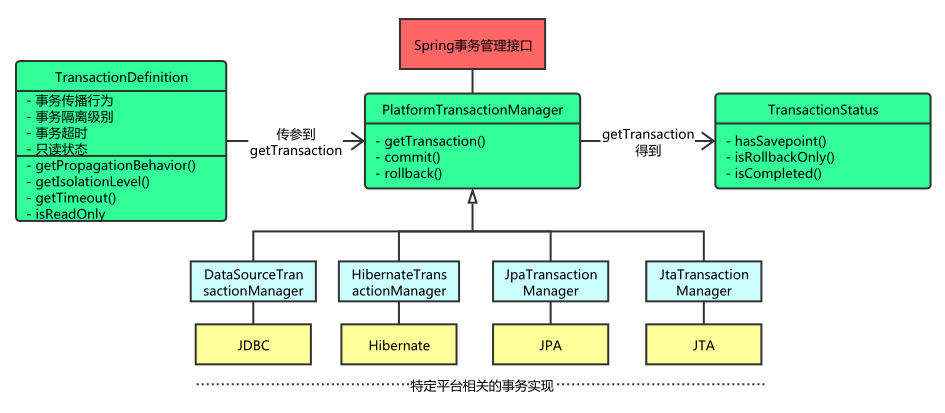

Spring事务的其实就是数据库对事务的支持，使用JDBC的事务管理机制,就是利用java.sql.Connection对象完成对事务的提交

事务是指在一系列的数据库操作过程中，一旦其中某一个动作出现错误，可以进行全部回滚，让系统将事务中对数据库的所有已完成的操作全部撤消，滚回到事务开始的状态，避免出现由于数据不一致而导致的接下来一系列的错误。

事务的出现是为了**确保数据的完整性和一致性**，在实际开发中，事务管理是必不可少的。


# 事务基础

## 事务有四大特性（ACID）

* **原子性（Atomicity）**：事务是一个原子操作，由一系列动作组成。事务的原子性确保动作要么全部完成，要么完全不起作用。
* **一致性（Consistency）**：事务在完成时，必须是所有的数据都保持一致状态。
* **隔离性（Isolation）**：并发事务执行之间无影响，在一个事务内部的操作对其他事务是不产生影响，这需要事务隔离级别来指定隔离性。
* **持久性（Durability）**：一旦事务完成，数据库的改变必须是持久化的。


## 事务并发问题

在企业级应用中，多用户访问数据库是常见的场景，这就是所谓的事务的并发。事务并发所可能存在的问题： 

* **脏读**：一个事务读到另一个事务未提交的更新数据。 
* **不可重复读**：一个事务两次读同一行数据，可是这两次读到的数据不一样。 
* **幻读**：一个事务执行两次查询，但第二次查询比第一次查询多出了一些数据行。 
* **丢失更新**：撤消一个事务时，把其它事务已提交的更新的数据覆盖了。


# Spring事务

Spring事务管理的核心接口是PlatformTransactionManager ；事务管理器接口通过getTransaction方法根据指定的传播行为返回当前活动的事务或创建一个新的事务，这个方法里面的参数是TransactionDefinition类，这个类就定义了一些基本的事务属性。 



在TransactionDefinition接口中定义了它自己的传播行为和隔离级别 ，源码如下：

```java
public interface TransactionDefinition {
    int PROPAGATION_REQUIRED = 0;
    int PROPAGATION_SUPPORTS = 1;
    int PROPAGATION_MANDATORY = 2;
    int PROPAGATION_REQUIRES_NEW = 3;
    int PROPAGATION_NOT_SUPPORTED = 4;
    int PROPAGATION_NEVER = 5;
    int PROPAGATION_NESTED = 6;
    int ISOLATION_DEFAULT = -1;
    int ISOLATION_READ_UNCOMMITTED = 1;
    int ISOLATION_READ_COMMITTED = 2;
    int ISOLATION_REPEATABLE_READ = 4;
    int ISOLATION_SERIALIZABLE = 8;
    int TIMEOUT_DEFAULT = -1;

    int getPropagationBehavior();
    int getIsolationLevel();
    int getTimeout();
    boolean isReadOnly();
    @Nullable
    String getName();
}
```


## Spring传播途径

**以下途径支持当前事务**

1. propagation_required：默认，表示当前必须有事务；当前有事务，则支持当前事务，如果不存在 就新建一个
2. propagation_supports：表示支持当前事务；如果不存在，就不使用事务 
3. propagation_mandatory：支持当前事务，如果当前事务不存在，抛出异常 

**以下途径不支持当前事务**

1. propagation_requires_new：表示新建一个事务，也就是说，如果当前没有事务则新建一个，就算有，也挂起当前事务，新建一个的事务，
2. propagation_not_supported：表示不支持当前事务；如果有事务存在，挂起当前事务 ，没有则以非事务方式运行
3. propagation_never：表示不要事务，以非事务方式运行；如果有事务存在，就抛出异常
4. propagation_nested：表示嵌套事务；如果当前存在事务，则在嵌套事务内执行。（换句话说就是，他的提交是要等和他的父事务一块提交的，父回滚他回滚）；如果当前没有事务，则进行与PROPAGATION_REQUIRED类似的操作。

## Spring事务的隔离级别

1. **ISOLATION_DEFAULT**：默认隔离级别，使用数据库默认的事务隔离级别
2. **ISOLATION_READ_UNCOMMITTED**：未提交读；充许另外一个事务可以看到这个事务未提交的数据。这种隔离级别会产生脏读，不可重复读和幻读。这是事务最低的隔离级别
3. **ISOLATION_READ_COMMITTED**：提交读(Oracle\sqlserver  默认)，保证一个事务修改的数据提交后才能被另外一个事务读取
4. **ISOLATION_REPEATABLE_READ**：可重复读（Mysql 默认）；这个事务不结束，别的事务就不可以改这条记录，加锁；这种事务隔离级别可以防止脏读，不可重复读。但是可能出现幻读。
5. **SERIALIZABLE**（serializable）：串行化（级别最高），花费最高代价。事务被处理为顺序执行，运行完一个事务的所有子事务之后才可以执行另外一个事务，有效的防止脏读，不可重复读 和幻读。


# 配置事务管理器

Spring提供了两种事务管理的方式：编程式事务管理和声明式事务管理

## 编程式事务管理

编程式事务管理我们可以通过PlatformTransactionManager实现来进行事务管理，同样的Spring也为我们提供了模板类TransactionTemplate进行事务管理，下面主要介绍模板类，我们需要在配置文件中配置

```xml
<!-- 配置事务管理器 -->
<bean id="transactionManager" class="org.springframework.jdbc.datasource.DataSourceTransactionManager">
    <property name="dataSource" ref="dataSource" />
</bean>
<!--配置事务管理的模板-->
<bean id="transactionTemplate" class="org.springframework.transaction.support.TransactionTemplate">
    <property name="transactionManager" ref="transactionManager"></property>
    <!--定义事务隔离级别,-1表示使用数据库默认级别-->
    <property name="isolationLevelName" value="ISOLATION_DEFAULT"></property>
    <property name="propagationBehaviorName" value="PROPAGATION_REQUIRED"></property>
</bean>
```


## 声明式事务管理

声明式事务管理有两种常用的方式，一种是基于tx和aop命名空间的xml配置文件，一种是基于@Transactional注解，随着Spring和Java的版本越来越高，大家越趋向于使用注解的方式

### **基于tx和aop命名空间的xml配置文件**

```xml
<!--基于数据源的数据管理器-->
<bean id="txManager" class="org.springframework.jdbc.datasource.DataSourceTransactionManager" p:dataSource-ref="dataSource"/>
<!--  配置事务传播特性 -->
<tx:advice id="advice" transaction-manager="transactionManager">
    <tx:attributes>
        <tx:method name="insert" propagation="REQUIRED" read-only="false"  rollback-for="Exception"/>
    </tx:attributes>
</tx:advice>
<!--  配置参与事务的类 -->
<aop:config>
    <aop:pointcut id="pointCut" expression="execution (* com.gray.service.*.*(..))"/>
    <aop:advisor advice-ref="advice" pointcut-ref="pointCut"/>
</aop:config>
```

### **基于@Transactional注解**

开启对注解事务管理的支持

```xml
<!-- 声明式事务管理 配置事物的注解方式注入-->
<tx:annotation-driven transaction-manager="transactionManager"/>
```

在需要事务管理的地方加上@Transactional注解，如：

```java
@Transactional(rollbackFor=Exception.class)
public void insert(String sql, boolean flag) throws Exception {
    dao.insertSql(sql);
    // 如果flag 为 true ，抛出异常
    if (flag){
        throw new Exception("has exception!!!");
    }
}
```

