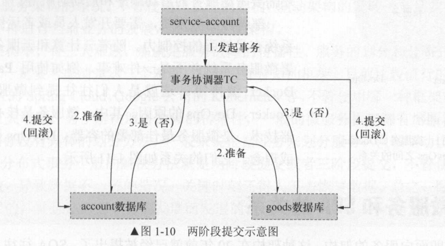
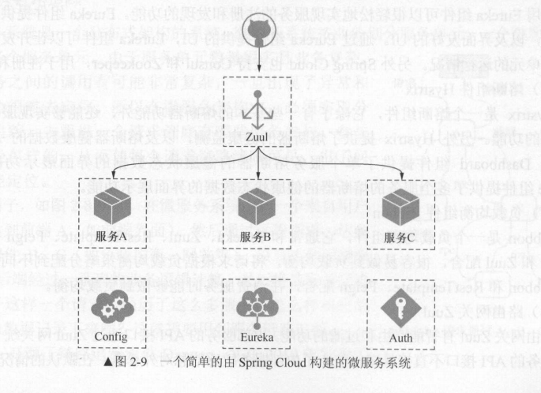

## 微服务

### 微服务的诞生

微服务是基于分而治之的思想演化出来的。过去传统的一个大型而又全面的系统，随着互联网的发展已经很难满足市场对技术的需求，于是我们从单独架构发展到分布式架构，又从分布式架构发展到 SOA 架构，服务不断的被拆分和分解，粒度也越来越小，直到微服务架构的诞生。

微服务架构是一种架构模式，它提倡将单一应用程序划分成一组小的服务，服务之间互相协调、互相配合，为用户提供最终价值。

每个服务运行在其独立的进程中，服务和服务间采用轻量级的通信机制互相沟通（通常是基于 HTTP 的 RESTful API）。每个服务都围绕着具体业务进行构建，并且能够被独立地部署到生产环境、类生产环境等。另外，应尽量避免统一的、集中式的服务管理机制，对具体的一个服务而言，应根据业务上下文，选择合适的语言、工具对其进行构建。

### 微服务架构与SOA架构的区别

微服务是真正的分布式的、去中心化的。把所有的“思考”逻辑包括路由、消息解析等放在服务内部，去掉一个大一统的 ESB，服务间轻通信，是比 SOA 更彻底的拆分。

微服务架构强调的重点是业务系统需要彻底的组件化和服务化，原有的单个业务系统会拆分为多个可以独立开发，设计，运行和运维的小应用，这些小应用之间通过服务完成交互和集成。

### 微服务架构引发的问题

随着整个业务数据被分散在各个子服务之后，也带来了两个最明显的问题。

* 业务管理系统对数据完整性查询，比如分页查询、多条件查询等，数据被割裂后如何来整合?
* 数据分析挖掘，这些需求可能需要分析全量的数据，并且在分析时不能影响到当前业务

从技术方案来讲，我们一般有两种选择来处理这些问题，第一种是在线处理数据，第二种是离线处理数据。

* 在线处理数据的方案：通过微服务提供的接口来获取数据，然后进行数据整合，不过这种方式有着明显的弊端，就是调用者需要编写大量的代码进行数据处理。其次在对各个微服务进行调取数据时会影响微服务的正常业务处理性能

* 离线处理数据方案：将业务数据准实时的同步到另外一个数据库中，在同步的过程中进行数据整合处理，以满足业务方对数据的需求，数据同步过来后，再提供另外一个服务接口专业负责对外输出数据信息，这种方案有两个特点：1）数据同步方案是关键，技术选型有很多，如何选择切合公司业务的技术方案；2）离线数据处理对微服务正常业务处理没有影响。

推荐使用第二种，利用 Spring Boot 和 MongoDB 可以轻松的解决这个问题，通过技术手段将分裂到 N 个微服务的数据同步到 MongoDB 集群中，在同步的过程中进行数据清洗，来满足公司的各项业务需求

在微服务架构中，有 大难题，那就是`服务故障的传播性`、`服务的划分`和`分布式事务`。

## CAP 理论

> Consistency ：指数据的强 致性。如果写入某个数据成功，之后读取，读到的都是新 写入的数据：如果写入失败，之后读取的都不是写入失败的数据。 
>
> Availability ：指服务的可用性 
>
> Partition-tolerance ：指分区容错

在分布式系统中 P是基本要求，而单体服务是 CA 系统， 微服务系统通常是 AP 系统，即同时满足了可用性和分区容错。

这就有了 个难题：在分布式系统中如何保证数据的一致性？这就是大家经常讨论的**分布式事务**

## 分布式事务

在微服务架构中，分布式事务 般的解决办法就是**两阶段提交**或者 **三阶段**提交，不管使用哪都存在事务失败，导致数据不 致的情况，关键时刻还得人工去恢复数据。

* 第一阶段：发起一个分布式事务，交给事务协调器TC处理，TC向多有的参与事务的节点发送处理事务操作的准备操作。所有的参与节点执行准备操作，将Undo和Redo 信息写进日志，并向事务管理器返回准备操作是否成功
* 第二阶段：事务管理器收集所有节点的准备操作是否成功，如果都成功，则通知所有的节点执行提交操作；如果有 个失败，则执行回滚操作

两阶段提交，将事务分成两部分能够大大提高分布式事务成功的概率。如果在第 阶段都成功了，而执行第 阶段的某 个节点失败，仍然导致数据的不准确，这时一般需要人工去处 理，这就是当初在第一步记录日志的原因。另外，如果分布式事务涉及的节点很多，某 个节 点的网络出现异常会导致整个事务处于阻塞状态，大大降低数据库的性能。**所以一般情况下， 尽量少用分布式事务。**

## 服务划分

原则：是服务和服务之间无耦合，任何一个服务都可以被替换，服务有自己 严格的边界；

不过服务的划分没有具体的划分方法， 一般来说根据业务来划分服务，领域驱动设计具有指 

导作用

总之，微服务的设计一定要渐进式的，并且随着业务发展而发展

> 微服务特点：
>
> * 按照业务划分服务，单个服务代码量小，业务单一，易于维护
>* 每个微服务都有自己独立的基础组件，例如数据库、缓存等且运行在独立的进程中
> * 微服务之间的通信是通过HTTP协议或者消息组件，且具有容错能力
>* 微服务有一套服务治理的解决方案，服务之间不耦合，可以随时加入和剔除
> * 单个微服务能够集群化部署，并且有负责 均衡的能力
>* 整个微服务系统应该有完整的安全机制，包括用户验证，权限验证，资源保护
> *  整个微服务系统有链路追踪的能力
>*  有一套完整的实时日志系统

## 熔断器

为了解决分布式系统的雪崩效应，分布式系统引进了**熔断器机制**。

> 当一个服务的处理用户请求的失败次数在一定时间内小于设定的阀值时，熔断器出于关闭状态，服务正常。

> 当服务处理用户请求失败次数在一定时间内大于设定的阀值时，说明服务出现故障，打开熔断器，这是所有的请求会快速失败，不执行业务逻辑

> 当处于打开状态的熔断器时，一段时间后出于半打开状态，并执行一定数量的请求，剩余的请求会执行快速失败，若执行请求失败了，则继续打开熔断器，若成功了，则将熔断器关闭

熔断器不仅能防止系统的“雪崩”效应，还具有以下作用

* 将资源进行隔离
* 服务降级的功能
* 自我修复能力

## 服务网关

在微服务系统中，API 接口资源通常是有服务网关（也称API网关）统一暴露，内部服务不直接对外提供API资源的暴露。好处在于隐藏内部服务，保护系统安全

网关层通常以集群的形式存在。并在服务网关层前通常会加上Nginx 用来负载均衡

网关意义：

* 网关将所有服务的API接口资源统一聚合，对外统一暴露
* 网关可以做一些用户身份认证，权限认证，防止非法请求操作API 接口，对内部服务起到保护作用
* 网关可以实现监控功能，实时日志输出、对请求进行记录
* 网关可以用来做流量监控，在高流量的情况下，对服务进行降级
* API 接口从内部服务分离出来，方便做测试

当然，网关实现这些功能，需要做高可用，否则网关很可能成功架构的瓶颈，最常用的网关组件Zuul、Nginx

## 服务配置统一管理

在微服务架构中，需要有统一管理配置文件的组件，例如：SpringCloud Config组件、阿里的Diamond、百度的Disconf、携程的Apollo等

## 服务链路追踪

在微服务架构中，必须实现分布式链路追踪，去跟进一个请求到底有哪些服务参与、参与顺序，是每个请求链路清晰可见，便于问题快速定位

常用链路追踪组件有Google的Dapper、Twitter 的Zipkin，以及阿里Eagleeye(鹰眼)

## SpringCloud常用组件

* Eureka：服务注册和发现组件

* Hystrix：熔断组件

* Ribbon：负载均衡组件

* Zuul：路由网关

以上4个组件来自于Netflix 公司，统称为Spring Cloud Netflix 

* Spring Cloud Config：配置文件统一管理
* Spring Cloud Security：Spring Security组件封装，提供用户验证和权限验证，一般与Spring Security OAuth2 组一起使用，通过搭建授权服务，验证Token或者JWT这种形式对整个微服务系统进行安全验证
* Spring Cloud  Sleuth：分布式链路追踪组件，他分封装了Dapper、Zipkin、Kibana 的组件
* Spring Cloud Stream：Spring Cloud框架的数据流操作包，可以封装RabbitMq，ActiveMq，Kafka，Redis等消息组件，利用Spring Cloud Stream可以实现消息的接收和发送

一个简单的Spring Cloud 构建的微服务系统，通常由服务注册中心Eureka、网关Zuul、配置中心Config和授权服务Auth构成

## 微服务框架

市面常用微服务框架有：Spring Cloud 、Dubbo 、kubernetes

* 从功能模块上考虑，Dubbo缺少很多功能模块，例如网关、链路追踪等

* 从学习成本上考虑，Dubbo 版本趋于稳定，稳定完善、可以即学即用，难度简单，Spring cloud 基于Spring Boot，需要先掌握Spring Boot ，例外Spring cloud  大多为英文文档，要求学习者有一定的英文阅读能力

* 从开发风格考虑，Dubbo倾向于xml的配置方式，Spring cloud 基于Spring Boot ，采用基于注解和JavaBean配置方式的敏捷开发
* 从开发速度上考虑，Spring cloud 具有更高的开发和部署速度
* 从通信方式上考虑，Spring cloud 基于HTTP Restful 风格，服务于服务之间完全无关、无耦合。Dubbo 基于远程调用，对接口、平台和语言有强依赖性，如果需要实现跨平台，需要有额外的中间件。