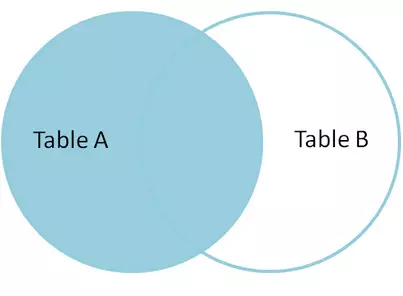

# SQL基础

# 基本定义

## 1、ACID特性

总得来说，事务是为了保证数据的安全性，一致性，正确性。必须满足所谓的**ACID**(原子性、一致性、隔离性和持久性)属性

- **原子性(atomic)**，事务必须是原子工作单元；对于其数据修改，要么全都执行，要么全都不执行
- **一致性(consistent)**，事务的执行结果，必须是从一个一致状态，变成另一个新的一致状态。事务的原子性保证其一致性
- **隔离性(insulation)**，主要在并发时，各个事务之间互不影响。并发事务所作的修改必须与任何其它并发事务所作的修改隔离。
- **持久性(Duration)**，事务一旦提交，数据就永久的保存在数据库，它对于系统的影响是永久性的。


# 数据类型

## 整数类型

可以使用的整数类型有：TINYINT，SMALLINT，MEDIUMINT，INT，BIGINT。分别使用   8、16、24、32、64位存储空间。存储范围从-2^(N-1)^ 到  2^(N-1)^ - 1，其中N是存储空间位数

整数类型有可选的 `unsigned` 属性，表示不允许负值，可以使正数的上限提高一倍，例如：tinyint unsigned 范围是0~255，而tinyint 的存储范围是 128~127


整数类型可以指定宽度，如 int (n) ：n 表示 zerofill  状态下，显示的最少字符长度，与存储空间大小无关（int 都在4个字节长度）


---

小数类型，使用decimal、float、double。其中decimal用于存储精确的小数，如存储财务数据。

decimal存储是每4个字节存9个数字，MySQL5.0 后允许存储最多65个数字

float 使用4个字节存储

double 使用8个字节存储


## 字符串类型

MySQL支持多种字符串类型，且每种类型还有很多变种。其中 `varchar`和`char` 为两种主要的类型

* char(n) ：固定长度，自动填充至n 个字符长度，最多255字符。不易产生空间碎片。

* varchar(n)：可变长度，比定长类型更省空间 ，需要1个或者2个字节表示长度（>=255时2个）

CHAR 存储时MySQL会删除所有的末尾空格，varchar 不会（4.1 之前会）


*   binary和varbinary ：char 和varchar类似，用于存储二进制数据
*   blob 和text类型：分别存储二进制和字符，Memory 引擎不支持该类型，不过需要使用MyISAM 引擎


## 枚举类型

有时候可以使用枚举代替常用的字符串类型。枚举列一般会将不重复的字符串存储成一个预定义的结合

通常枚举列是以tinyint 存储的，所以需要避免数组作为枚举常量。

缺点：字符串列表固定，添加或删除字符串必须使用ALTER TABLE


## 日期和时间类型

MySQL提供两种相似的日期类型：datetime 和 timestamp

*   datetime ，从1001年到9999年，精度秒，8个字节，与时区无关
*   timestamp，从1970 到 2038年，精度秒，4个字节，依赖时区，与UNIX 时间戳相同，可用from_unixtime()和unix_timestamp()进行时间戳和日期的互转。并且默认 NOT NULL

推荐使用timestamp类型，它比datetime的空间效率更高


# 连接查询

mysql 连接查询分：

- **INNER JOIN（内连接,或等值连接）**
- **LEFT JOIN（左连接）**
- **RIGHT JOIN（右连接）**

举例说明：

student、class 表如下：

```sql
SELECT * FROM student;
+-----+-------+
| sid | sname |
+-----+-------+
|   1 | aaa   |
|   2 | bbb   |
|   3 | ccc   |
|   4 | ddd   |
+-----+-------+

SELECT * FROM class;
+-----+------+-------+
| cid | sid  | cname |
+-----+------+-------+
|   1 |    1 | 语文  |
|   2 |    1 | 数学  |
|   3 |    2 | 英语  |
|   4 |    2 | 数学  |
|   5 |    9 | 美术  |
+-----+------+-------+
```

## INNER JOIN

```sql
SELECT * FROM student s inner JOIN class c ON c.sid = s.sid;
+-----+-------+-----+------+-------+
| sid | sname | cid | sid  | cname |
+-----+-------+-----+------+-------+
|   1 | aaa   |   1 |    1 | 语文  |
|   1 | aaa   |   2 |    1 | 数学  |
|   2 | bbb   |   3 |    2 | 英语  |
|   2 | bbb   |   4 |    2 | 数学  |
+-----+-------+-----+------+-------+
```

**从上数据可以看出：并不包含student表中sid=3、4的数据（即 sname 为 ccc、ddd 的数据），也不包含class 表中的 sid =9 的数据**

从笛卡尔积的角度：就是从笛卡尔积中**挑出ON子句条件成立的记录**

**即：查出两个表中所有满足 `ON` 条件的数据，即`两个表的交集`**


## LEFT JOIN

```sql
mysql> SELECT * FROM student s LEFT  JOIN class c ON c.sid = s.sid;
+-----+-------+------+------+-------+
| sid | sname | cid  | sid  | cname |
+-----+-------+------+------+-------+
|   1 | aaa   |    1 |    1 | 语文  |
|   1 | aaa   |    2 |    1 | 数学  |
|   2 | bbb   |    3 |    2 | 英语  |
|   2 | bbb   |    4 |    2 | 数学  |
|   3 | ccc   | NULL | NULL | NULL  |
|   4 | ddd   | NULL | NULL | NULL  |
+-----+-------+------+------+-------+
```

从笛卡尔积的角度讲，就是先从笛卡尔积中挑出ON子句条件成立的记录，然后加上左表中剩余的记录（见最后三条）。

**即：查出两个表中所有满足 `ON` 条件的数据，外加`左表`不满足`ON`的数据**



## RIGHT JOIN

```sql
mysql> SELECT * FROM student s RIGHT  JOIN class c ON c.sid = s.sid;
+------+-------+-----+------+-------+
| sid  | sname | cid | sid  | cname |
+------+-------+-----+------+-------+
|    1 | aaa   |   1 |    1 | 语文  |
|    1 | aaa   |   2 |    1 | 数学  |
|    2 | bbb   |   3 |    2 | 英语  |
|    2 | bbb   |   4 |    2 | 数学  |
| NULL | NULL  |   5 |    9 | 美术  |
+------+-------+-----+------+-------+
```

同理右连接RIGHT JOIN就是求两个表的交集外加右表剩下的数据。再次从笛卡尔积的角度描述，右连接就是从笛卡尔积中挑出ON子句条件成立的记录，然后加上右表中剩余的记录（见最后一条）。

**即：查出所有满足 `ON` 条件的数据，外加`右表`不满足`ON`的数据**


## Join 实现原理

**Join执行过程**

在MySQL中，A left join B on condition 的执行过程如下：

1）以 table_A 为驱动表，检索 table_B
2）根据 on 条件过滤 table_B 的数据，构建 table_A 结果集，并且添加外部行。
3）对结果集执行 where 条件过滤。如果A中有一行匹配 where 子句但是B中没有一行匹配on条件，则生成另一个B行，其中所有列设置为NULL。
4）执行 group by 语句分组
5）执行 having 语句对分组结果筛选
6）执行 select 出结果集。
7）执行 distinct 对结果去重
8）执行 order by 语句
9）执行 limit 语句

上面需要注意的重点是：MySQL会先进行连接查询，**然后再使用where子句查询结果，再从结果执行order by**。所以如果被驱动表数据过大，会造成检索行过多。可以利用子查询先查询出一个较小的结果集，然后再用连接驱动。

right join 的执行类似 left join ，只是表的角色相反。


# 索引基础

索引类型分：B-tree 索引、Hash 索引（常见的只有Memory 引擎显式支持）

## 前缀索引

对于BLOB、text 或者很长的 varchar 类型的列，必须使用前缀索引，在MySQL中，前缀长度最大值为255字节。对于存储引擎为MyISAM或InnoDB的数据表，前缀最长为1000字节。

```sql
ALTER TABLE schema.tableName ADD INDEX idx_xxx(columnName(7))
```

优点：索引更小更快

缺点：无法用索引做order by 和group by，也无法使用它做覆盖扫描


**如何确定前缀索引长度？**

 可以通过计算选择性来确定前缀索引的选择性，计算方法如下

 全列选择性：

```sql
SELECT COUNT(DISTINCT column_name) / COUNT(*) FROM table_name;
```

 某一长度前缀的选择性

```sql
SELECT COUNT(DISTINCT LEFT(column_name, prefix_length)) / COUNT(*) FROM table_name;
```

 当前缀的选择性越接近全列选择性的时候，索引效果越好。


## 联合索引

又称多列索引，索引按照最左列进行排序，

选择索引列顺序的原则：

- 优先 WHERE 子句中的排序、分组和范围
- 当不需要考虑排序和分组时，将选择性最高的列放在前面。


当不需要考虑排序和分组时，将选择性最高的列放在前面。

确认顺序方法，如：

```sql
select * from payment where staff_id = 2 and customer_id 584 ;
```

计算：

```sql
select 
	count(distinct staff_id)/count(*) as staff_id_selectivity,
	count(distinct customer_id)/count(*) as customer_id_selectivity,
	count(*)
from payment 
******************** 1.row ************************
	staff_id_selectivity：0.0001
 customer_id_selectivity：0.0373
				   count：16049
```

从以上结果，customer_id 的选择性更高，所以应该将其作为索引列的第一列

## 聚簇索引

聚簇索引不是一种单独的索引类型，而是一种数据存储方式。一个表只能有一个聚簇索引


## 覆盖索引

覆盖索引指：索引包含（或者说覆盖）所有需要查询的字段的值，一般在EXPLAIN 的Extra列会出现“Using index”的信息