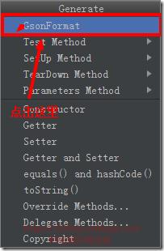

# Key promoter

Key promoter 是IntelliJ IDEA的快捷键提示插件，会统计你鼠标点击某个功能的次数，提示你应该用什么快捷键，帮助记忆快捷键，等熟悉了之后可以关闭掉这个插件。

# Gsonformat

可根据json数据快速生成java实体类。

自定义个javaBean(无任何内容，就一个空的类)，复制你要解析的Json，然后alt+insert弹出如下界面或者使用快捷键 Alt+S，在里面粘贴刚刚复制的Json，点击OK即可。

